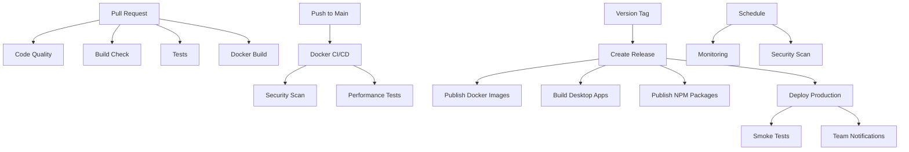

# Spotify Clone CI/CD Documentation

## 📋 Overview

This project uses a comprehensive CI/CD pipeline with GitHub Actions covering:
- ✅ Code quality & security scanning
- 🧪 Automated testing (unit, integration, e2e)
- 🐳 Docker builds & deployments
- 📊 Performance monitoring
- 🚀 Automated releases
- 🔄 Continuous monitoring

## 🔄 Workflow Files

### Core Workflows

#### 1. Pull Request (`pull_request.yml`)
**Triggers:** On pull requests to main/develop branches

**Jobs:**
- **code-quality**: Runs Biome linter & formatter checks
- **build-check**: Verifies all apps can build successfully
- **tests**: Runs unit & integration tests with PostgreSQL & Redis
- **docker-build**: Builds Docker images for api/web/admin
- **pr-summary**: Posts summary comment with job status

**Key Features:**
- Concurrency control (cancels outdated runs)
- pnpm caching for faster builds
- Parallel job execution
- Auto-generated PR comments with test results

**Usage:**
```bash
# Automatically runs on:
git push origin feature/my-feature
```

---

#### 2. Docker CI/CD (`docker.yml`)
**Triggers:** Push to main/develop, manual dispatch

**Jobs:**
- **detect-changes**: Uses dorny/paths-filter to detect which apps changed
- **build-{service}**: Matrix build for api/web/admin/mobile/desktop
- **security-scan**: Trivy vulnerability scanning + SBOM generation
- **integration-tests**: End-to-end Docker Compose testing
- **performance**: k6 load testing against containerized API

**Key Features:**
- Smart change detection (only builds affected services)
- Multi-platform builds (amd64, arm64)
- Security scanning with Trivy
- SBOM (Software Bill of Materials) generation
- Performance benchmarking
- GitHub Container Registry publishing

**Usage:**
```bash
# Runs automatically on push to main/develop
git push origin main

# Manual trigger
gh workflow run docker.yml
```

---

#### 3. Deployment (`deploy.yml`)
**Triggers:** Manual dispatch, release tags

**Jobs:**
1. **validate**: Pre-deployment checks (Docker health, SSH connectivity)
2. **tests**: Optional test suite (can be skipped)
3. **build**: Matrix build for api/web/admin
4. **deploy**: Zero-downtime rolling deployment with backup/rollback
5. **post-deploy**: CDN cache clearing, release tagging
6. **smoke-tests**: Critical endpoint verification
7. **notify**: Team notifications (Slack/Discord)

**Key Features:**
- Zero-downtime deployments
- Automatic backup before deploy
- Rollback on failure
- Health checks between container updates
- Smoke tests after deployment
- CDN cache invalidation

**Usage:**
```bash
# Manual deployment
gh workflow run deploy.yml -f environment=staging

# Automatic on release
git tag v1.2.3
git push origin v1.2.3
```

**Required Secrets:**
- `SERVER_HOST`: Production server hostname
- `SERVER_USER`: SSH username
- `SERVER_SSH_KEY`: SSH private key
- `SLACK_WEBHOOK_URL` (optional)
- `DISCORD_WEBHOOK_URL` (optional)

---

#### 4. Security & Quality (`security.yml`)
**Triggers:** Push, PRs, weekly schedule (Sundays at 00:00)

**Jobs:**
- **dependency-audit**: pnpm audit for vulnerable dependencies
- **codeql**: Advanced security analysis (JavaScript/TypeScript)
- **semgrep**: SAST scanning (security-audit, secrets, OWASP Top 10)
- **license-check**: License compliance verification
- **dockerfile-scan**: Hadolint Dockerfile linting
- **secret-scan**: TruffleHog secret detection in git history
- **bundle-size**: Bundle size budget enforcement

**Key Features:**
- Weekly automated security scans
- CodeQL code analysis
- Secret detection in commits
- License compliance checks
- Bundle size tracking
- SAST with Semgrep

**Usage:**
```bash
# Runs automatically on schedule
# Manual trigger:
gh workflow run security.yml
```

---

#### 5. Performance Testing (`performance.yml`)
**Triggers:** PRs affecting api/web, weekly (Mondays at 02:00), manual

**Jobs:**
- **api-load-test**: k6 load testing with staged ramp-up
- **lighthouse**: Lighthouse CI for web performance
- **bundle-analysis**: Next.js bundle size analysis
- **db-performance**: Database query performance testing

**Key Features:**
- Load testing with k6 (50→100 concurrent users)
- Lighthouse CI scores
- Bundle size comparison
- Slow query detection
- Automatic PR comments with results

**Load Test Thresholds:**
- P95 response time < 500ms
- P99 response time < 1000ms
- Error rate < 5%

**Usage:**
```bash
# Runs automatically on API/web changes
# Manual trigger:
gh workflow run performance.yml
```

---

#### 6. Continuous Monitoring (`monitoring.yml`)
**Triggers:** Every 6 hours, manual dispatch

**Jobs:**
- **health-check**: Production health monitoring
- **dependency-updates**: Check for outdated packages
- **image-size-monitor**: Track Docker image sizes
- **ssl-check**: SSL certificate expiry monitoring
- **backup-check**: Verify backup recency

**Key Features:**
- 24/7 production health checks
- Response time monitoring
- Automatic issue creation for critical updates
- SSL certificate expiry alerts (30-day warning)
- Image size tracking

**Usage:**
```bash
# Runs automatically every 6 hours
# Manual health check:
gh workflow run monitoring.yml
```

---

#### 7. Release (`release.yml`)
**Triggers:** Version tags (v*.*.*)

**Jobs:**
- **create-release**: Generate GitHub release with changelog
- **publish-images**: Publish Docker images to GHCR + Docker Hub
- **build-desktop**: Build desktop apps (Windows, macOS, Linux)
- **publish-packages**: Publish NPM packages (@spotify/ui-react, @spotify/contracts)
- **deploy-production**: Trigger production deployment

**Key Features:**
- Automated changelog generation
- Multi-platform desktop builds
- Docker image publishing (GHCR + Docker Hub)
- NPM package publishing
- Production deployment trigger

**Usage:**
```bash
# Create and push version tag
git tag v1.2.3
git push origin v1.2.3

# This triggers:
# 1. GitHub release creation
# 2. Docker images published
# 3. Desktop apps built for all platforms
# 4. NPM packages published
# 5. Production deployment
```

**Required Secrets:**
- `GITHUB_TOKEN` (auto-provided)
- `DOCKERHUB_USERNAME` (optional)
- `DOCKERHUB_TOKEN` (optional)
- `NPM_TOKEN` (optional)

---

### Platform-Specific Workflows

#### Desktop App (`desktop.yml`)
**Triggers:** PRs, pushes, tags

**Features:**
- Multi-OS builds (Ubuntu, Windows, macOS)
- Tauri Rust compilation
- Automated signing (macOS, Windows)
- Release asset uploads

#### Mobile App (`mobile.yml`)
**Triggers:** PRs, pushes, tags

**Features:**
- Expo EAS builds
- iOS/Android compilation
- TestFlight/Play Store uploads
- OTA updates

#### Storybook (`chromatic.yml`)
**Triggers:** PRs, pushes

**Features:**
- Visual regression testing
- Chromatic deployment
- Component library publishing

---

## 🔐 Required Secrets

### Essential
```bash
# Server Access
SERVER_HOST=your-server.com
SERVER_USER=deploy
SERVER_SSH_KEY=<private-key>

# Docker Registry
DOCKERHUB_USERNAME=yourusername
DOCKERHUB_TOKEN=<access-token>

# NPM Publishing
NPM_TOKEN=<npm-token>
```

### Optional
```bash
# Notifications
SLACK_WEBHOOK_URL=https://hooks.slack.com/...
DISCORD_WEBHOOK_URL=https://discord.com/api/webhooks/...

# Mobile
EXPO_TOKEN=<expo-token>
APPLE_ID=your@email.com
GOOGLE_PLAY_JSON_KEY=<service-account-json>

# Monitoring
SENTRY_DSN=https://...@sentry.io/...
```

**Setting Secrets:**
```bash
# Via CLI
gh secret set SERVER_HOST -b "your-server.com"

# Via UI
Settings → Secrets and variables → Actions → New repository secret
```

---

## 📊 Workflow Dependencies



---

## 🚀 Common Workflows

### Development Flow
```bash
# 1. Create feature branch
git checkout -b feature/awesome-feature

# 2. Make changes & commit
git add .
git commit -m "feat: add awesome feature"

# 3. Push to GitHub
git push origin feature/awesome-feature

# 4. Create PR
gh pr create --title "Add awesome feature" --body "Description"

# ✅ Triggers: pull_request.yml
# - Code quality checks
# - Build verification
# - Tests
# - Docker build
```

### Release Flow
```bash
# 1. Update version in package.json files
pnpm version:patch  # or minor, major

# 2. Create and push tag
git tag v1.2.3
git push origin v1.2.3

# ✅ Triggers: release.yml
# - Creates GitHub release
# - Publishes Docker images
# - Builds desktop apps
# - Publishes NPM packages
# - Deploys to production
```

### Hotfix Flow
```bash
# 1. Create hotfix from main
git checkout main
git checkout -b hotfix/critical-bug

# 2. Fix and commit
git add .
git commit -m "fix: critical bug"

# 3. Push and create PR
git push origin hotfix/critical-bug
gh pr create

# 4. After merge, tag and release
git checkout main
git pull
git tag v1.2.4
git push origin v1.2.4

# ✅ Automatic deployment via release.yml
```

---

## 🔧 Workflow Customization

### Skipping Tests on Deploy
```bash
# Deploy without running tests
gh workflow run deploy.yml -f skip-tests=true
```

### Running Specific Docker Profiles
```yaml
# In docker-compose.yaml, use profiles:
docker compose --profile mobile up
docker compose --profile nginx up
```

### Adjusting Performance Thresholds
Edit [tests/load/api-load-test.js](tests/load/api-load-test.js):
```javascript
export const options = {
  thresholds: {
    http_req_duration: ['p(95)<500'], // Adjust threshold
    http_req_failed: ['rate<0.05'],   // Adjust error rate
  },
};
```

---

## 📈 Monitoring & Alerts

### Health Check Endpoints
- API: `https://your-server.com/health`
- Web: `https://your-server.com/`

### Alert Thresholds
- Response time > 2s: Warning
- Error rate > 5%: Critical
- SSL expiry < 30 days: Warning
- Failed deployment: Critical

### Viewing Workflow Results
```bash
# List workflow runs
gh run list --workflow=docker.yml

# View specific run
gh run view <run-id>

# View logs
gh run view <run-id> --log
```

---

## 🐛 Troubleshooting

### Failed Docker Build
```bash
# Check logs
gh run view --log

# Re-run failed jobs
gh run rerun <run-id> --failed

# Local testing
docker build -t test -f apps/api/Dockerfile .
```

### Deployment Rollback
Rollback is automatic on failure. Manual rollback:
```bash
# SSH to server
ssh deploy@your-server.com

# View backups
ls -la ~/backups/

# Restore backup
cd ~/spotify-clone
docker compose down
cp -r ~/backups/backup-YYYYMMDD-HHMMSS/* .
docker compose up -d
```

### Slow Performance Tests
```bash
# Check k6 results
gh run view --job api-load-test

# Run locally
k6 run tests/load/api-load-test.js

# Adjust load in api-load-test.js
```

---

## 📚 Additional Resources

- [README.md](../README.md) - Main documentation including Docker setup
- [GitHub Actions Docs](https://docs.github.com/actions)
- [k6 Load Testing](https://k6.io/docs/)
- [Lighthouse CI](https://github.com/GoogleChrome/lighthouse-ci)
- [Semgrep Rules](https://semgrep.dev/explore)

---

## 🎯 Best Practices

1. **Always create PRs** - Never push directly to main
2. **Use semantic versioning** - v1.2.3 (major.minor.patch)
3. **Write descriptive commits** - Follow conventional commits
4. **Test locally first** - Run `pnpm test` before pushing
5. **Monitor workflow runs** - Check GitHub Actions tab regularly
6. **Keep secrets updated** - Rotate credentials periodically
7. **Review security alerts** - Check weekly security scan results
8. **Monitor performance** - Review Lighthouse and k6 reports

---

## 🔄 Workflow Maintenance

### Updating Dependencies
```bash
# Update GitHub Actions
# Edit .github/workflows/*.yml and bump action versions

# Update k6
# Edit .github/workflows/performance.yml

# Update Docker base images
# Edit apps/*/Dockerfile
```

### Adding New Services
1. Create Dockerfile in `apps/<service>/`
2. Add to `docker-compose.yaml`
3. Add build job in `.github/workflows/docker.yml`
4. Add to deployment workflow
5. Update monitoring

---

**Last Updated:** $(date +%Y-%m-%d)
**Maintained By:** DevOps Team
