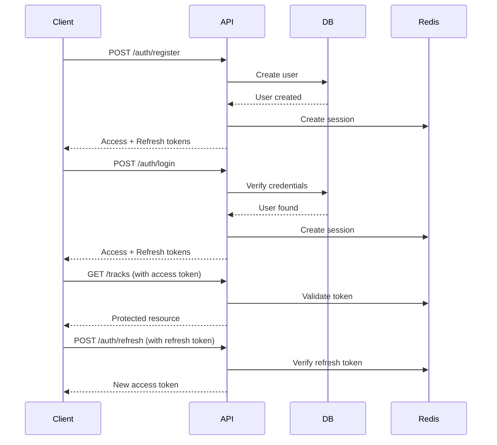

# Authentication

Complete guide for implementing authentication in API endpoints.

## 🔐 Overview

The API uses **JWT (JSON Web Tokens)** for authentication with access and refresh token pattern.

## 🏗️ Authentication Flow



## 🔑 Token Structure

### Access Token

```typescript
{
  sub: 'user-uuid',
  email: 'user@example.com',
  iat: 1234567890,
  exp: 1234568790  // 15 minutes
}
```

### Refresh Token

```typescript
{
  sub: 'user-uuid',
  sessionId: 'session-uuid',
  iat: 1234567890,
  exp: 1235172690  // 7 days
}
```

## 🛠️ Implementation

### Auth Module

```typescript
// src/modules/auth/auth.module.ts
@Module({
  imports: [
    JwtModule.register({
      secret: process.env.JWT_SECRET,
      signOptions: { expiresIn: '15m' }
    }),
    UsersModule
  ],
  controllers: [AuthController],
  providers: [AuthService, TokenService]
})
export class AuthModule {}
```

### Auth Service

```typescript
// src/modules/auth/auth.service.ts
@Injectable()
export class AuthService {
  async register(dto: RegistrationDto) {
    // Hash password
    const passwordHash = await bcrypt.hash(dto.password, 10)

    // Create user
    const user = await this.prisma.user.create({
      data: {
        email: dto.email,
        passwordHash,
        displayName: dto.displayName
      }
    })

    // Generate tokens
    const tokens = await this.tokenService.generateTokens(user)

    return { user, ...tokens }
  }

  async login(dto: LoginDto) {
    // Find user
    const user = await this.prisma.user.findUnique({
      where: { email: dto.email }
    })

    if (!user) {
      throw new UnauthorizedException('Invalid credentials')
    }

    // Verify password
    const isValid = await bcrypt.compare(dto.password, user.passwordHash)

    if (!isValid) {
      throw new UnauthorizedException('Invalid credentials')
    }

    // Generate tokens
    const tokens = await this.tokenService.generateTokens(user)

    return tokens
  }
}
```

### Token Service

```typescript
// src/modules/auth/token.service.ts
@Injectable()
export class TokenService {
  constructor(
    private jwtService: JwtService,
    private prisma: PrismaService
  ) {}

  async generateTokens(user: User) {
    // Create session
    const session = await this.prisma.session.create({
      data: {
        userId: user.id,
        expiresAt: new Date(Date.now() + 7 * 24 * 60 * 60 * 1000)
      }
    })

    // Access token
    const accessToken = this.jwtService.sign({
      sub: user.id,
      email: user.email
    })

    // Refresh token
    const refreshToken = this.jwtService.sign(
      {
        sub: user.id,
        sessionId: session.id
      },
      {
        secret: process.env.JWT_REFRESH_SECRET,
        expiresIn: '7d'
      }
    )

    return { accessToken, refreshToken }
  }

  async refreshTokens(refreshToken: string) {
    try {
      // Verify refresh token
      const payload = this.jwtService.verify(refreshToken, {
        secret: process.env.JWT_REFRESH_SECRET
      })

      // Check session
      const session = await this.prisma.session.findUnique({
        where: { id: payload.sessionId },
        include: { user: true }
      })

      if (!session || session.expiresAt < new Date()) {
        throw new UnauthorizedException('Invalid session')
      }

      // Generate new access token
      const accessToken = this.jwtService.sign({
        sub: session.user.id,
        email: session.user.email
      })

      return { accessToken }
    } catch (error) {
      throw new UnauthorizedException('Invalid refresh token')
    }
  }
}
```

## 🛡️ Auth Guard

```typescript
// src/common/guards/auth.guard.ts
@Injectable()
export class AuthGuard implements CanActivate {
  constructor(
    private jwtService: JwtService,
    private prisma: PrismaService
  ) {}

  async canActivate(context: ExecutionContext): Promise<boolean> {
    const request = context.switchToHttp().getRequest()

    // Extract token
    const token = this.extractToken(request)

    if (!token) {
      throw new UnauthorizedException('No token provided')
    }

    try {
      // Verify token
      const payload = await this.jwtService.verifyAsync(token)

      // Fetch user
      const user = await this.prisma.user.findUnique({
        where: { id: payload.sub }
      })

      if (!user) {
        throw new UnauthorizedException('User not found')
      }

      // Attach user to request
      request.user = user

      return true
    } catch (error) {
      throw new UnauthorizedException('Invalid token')
    }
  }

  private extractToken(request: Request): string | null {
    const [type, token] = request.headers.authorization?.split(' ') ?? []
    return type === 'Bearer' ? token : null
  }
}
```

## 📌 Using Guards

### Controller Level

```typescript
@Controller('tracks')
@UseGuards(AuthGuard)
export class TracksController {
  @Get()
  findAll(@CurrentUser() user: User) {
    return this.tracksService.findByUser(user.id)
  }
}
```

### Route Level

```typescript
@Controller('tracks')
export class TracksController {
  @Get()
  @UseGuards(AuthGuard)
  findAll() {
    // Protected
  }

  @Get('public')
  findPublic() {
    // Public
  }
}
```

### Global Guard

```typescript
// main.ts
app.useGlobalGuards(new AuthGuard())
```

## 🎯 Custom Decorators

### CurrentUser

```typescript
// src/common/decorators/current-user.decorator.ts
export const CurrentUser = createParamDecorator(
  (data: unknown, ctx: ExecutionContext) => {
    const request = ctx.switchToHttp().getRequest()
    return request.user
  }
)

// Usage
@Get('me')
getProfile(@CurrentUser() user: User) {
  return user
}
```

### Public

```typescript
// src/common/decorators/public.decorator.ts
export const IS_PUBLIC_KEY = 'isPublic'
export const Public = () => SetMetadata(IS_PUBLIC_KEY, true)

// Modified AuthGuard
canActivate(context: ExecutionContext) {
  const isPublic = this.reflector.getAllAndOverride<boolean>(
    IS_PUBLIC_KEY,
    [context.getHandler(), context.getClass()]
  )

  if (isPublic) {
    return true
  }

  // ... normal auth logic
}

// Usage
@Public()
@Get('public')
getPublic() {
  return 'Public data'
}
```

## 🔒 Password Security

### Hashing

```typescript
import * as bcrypt from 'bcrypt'

// Hash password
const hash = await bcrypt.hash(password, 10)

// Verify password
const isValid = await bcrypt.compare(password, hash)
```

### Password Requirements

```typescript
// src/modules/auth/dto/registration.dto.ts
export class RegistrationDto {
  @IsEmail()
  email: string

  @IsString()
  @MinLength(8)
  @Matches(/^(?=.*[a-z])(?=.*[A-Z])(?=.*\d)/, {
    message: 'Password must contain uppercase, lowercase, and number'
  })
  password: string

  @IsString()
  @MinLength(2)
  displayName: string
}
```

## 📝 Session Management

### Database Schema

```prisma
model Session {
  id        String   @id @default(uuid())
  userId    String
  user      User     @relation(fields: [userId])
  expiresAt DateTime
  createdAt DateTime @default(now())
}
```

### Logout

```typescript
async logout(userId: string, sessionId: string) {
  await this.prisma.session.delete({
    where: { id: sessionId, userId }
  })
}

// Logout all devices
async logoutAll(userId: string) {
  await this.prisma.session.deleteMany({
    where: { userId }
  })
}
```

## 🌐 CORS Configuration

```typescript
// main.ts
app.enableCors({
  origin: process.env.CORS_ORIGIN.split(','),
  credentials: true,
  allowedHeaders: ['Authorization', 'Content-Type'],
  methods: ['GET', 'POST', 'PUT', 'PATCH', 'DELETE']
})
```

## 🧪 Testing

```typescript
describe('AuthService', () => {
  it('should register a user', async () => {
    const dto = {
      email: 'test@example.com',
      password: 'Password123',
      displayName: 'Test User'
    }

    const result = await service.register(dto)

    expect(result.user).toBeDefined()
    expect(result.accessToken).toBeDefined()
    expect(result.refreshToken).toBeDefined()
  })

  it('should login with valid credentials', async () => {
    const dto = {
      email: 'test@example.com',
      password: 'Password123'
    }

    const result = await service.login(dto)

    expect(result.accessToken).toBeDefined()
  })

  it('should throw on invalid credentials', async () => {
    const dto = {
      email: 'test@example.com',
      password: 'WrongPassword'
    }

    await expect(service.login(dto)).rejects.toThrow(
      UnauthorizedException
    )
  })
})
```

---

**Related:**
- [API Overview](/applications/api/overview)
- [Security Best Practices](/guides/security)