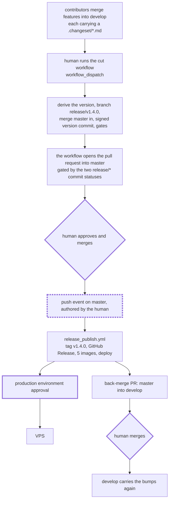

# ADR-0029: Release by a pull request a human merges, tagged with a derived product version

Status: **Accepted.** Implemented in `.github/workflows/` on 2026-09-05.

Date: 2026-09-05 (revised the same day: **Route B, not Route A** — see
[Layer 2](#layer-2--who-opens-the-pull-request) and [Revision history](#revision-history))

The operator-facing half — the exact commands to cut, dry-run and roll back a release — lives in
[Deployment § 7](../infrastructure/deployment.md#7-releasing).

## Context

The release chain has been rebuilt once already and is being rebuilt again for reasons worth
recording, because the attempts fail in different directions.

**The original chain was inert.** `release.yml` ran on a push to `master`, consumed the changesets,
committed `chore(release): version packages` back to `master`, and expected that commit — being a
push — to start the five image workflows and the deploy. GitHub does not create workflow runs for
push events authenticated with the default `GITHUB_TOKEN`, specifically to prevent recursion. So
the chain needed a personal access token, `RELEASE_TOKEN`, purely to make its own commit raise an
event. That secret was never set, and the entire chain — version, build, deploy — never ran.

**The replacement worked but bought its independence with plumbing.** Every stage started the next
with `POST /repos/{owner}/{repo}/actions/workflows/{file}/dispatches`, because `workflow_dispatch`
is one of the documented exceptions to the `GITHUB_TOKEN` rule. That removed the PAT, which was the
point, and it cost:

- two jobs holding `actions: write` whose only purpose is to start other workflows;
- a polling loop that answers "did the dispatch actually produce a run?", because the dispatch API
  returns `204` with no body and no run id;
- five separate runs plus a sixth for the deploy, so "what happened in release *N*?" is six tabs;
- a hard coupling to workflow *file names* and *input names* carried as strings in a workflow input.

None of that machinery exists to do work. It exists to manufacture an event, because the event that
should have started the chain was suppressed.

There is an event that is never suppressed and that this repository already produces on every
release: **a human merging a pull request.** A merge performed on github.com is authenticated as
that person, not as `GITHUB_TOKEN`, so the push to `master` it produces raises a push event and
starts workflows normally. That is the whole reason the canonical Changesets flow is built around a
release PR rather than a bot push, and it is why every comparable project in this space converged on
it.

**And a release had no version.** The previous design named each release
`release-YYYY.MM.DD-NN` — a date and a per-day counter. That was chosen because no single version
existed to use instead: thirteen workspaces bump independently while
`infra/docker-compose.prod.yaml` pulls five services at one shared `${IMAGE_TAG}`. But a date is not
a statement about *what changed*. `release-2026.09.05-02` does not tell a reader whether the release
was a bug fix or a breaking change, and the `-NN` counter existed only to stop two releases on the
same day from colliding — a problem a version does not have.

A product version does not exist in this repository today, and that is the gap this ADR closes.
The root `package.json` is `{"name": "bitrate", "private": true}` with **no `version` field**, and
the workspace versions carry no product meaning at all:

| Workspace | Version | | Workspace | Version |
|---|---|---|---|---|
| `@bitrate/api` | 0.1.0 | | `@bitrate/mobile` | 1.0.0 |
| `@bitrate/web-player` | 0.1.0 | | `@bitrate/converter` | 1.1.0 |
| `@bitrate/web-artists` | 0.1.1 | | `@bitrate/svgr` | 1.0.0 |
| `@bitrate/ui-react` | 0.0.2 | | `@bitrate/docs` | 0.0.0 |

`@bitrate/mobile` is at 1.0.0 because that is what `create-expo-app` writes; it is a scaffold with
no domain code. No one of these can stand for the stack.

## Decision

### The shape: gitflow, with the release PR as the hinge

`develop` is the default and integration branch, `master` is production, and
`.changeset/config.json` already sets `baseBranch: develop`. The release is five stages, and the
only one that requires a credential the repository does not already have is the one that does not
exist:

1. **Changesets accumulate on `develop`.** Unchanged. Contributors add `.changeset/*.md` in their
   feature PRs.
2. **A human cuts the release.** `release.yml`, `workflow_dispatch` only. It derives the next
   product version from the pending changesets, creates `release/v<version>` from `develop`, merges
   `master` into it server-side, runs `changeset version`, writes that product version into the
   root `package.json`, lands all of it as **one GitHub-signed commit**, runs the credential-free
   gates described below, and **opens the pull request into `master` itself**.
3. **A human reviews the release PR, approves it, and merges it.** The merge is the trigger: a
   human-authored push to `master`, which raises a push event and starts stage 4 with no PAT, no
   GitHub App, and no `workflow_dispatch` plumbing.
4. **`release_publish.yml` runs on `push: master`.** It reads the product version out of the merged
   tree's root `package.json`, creates the annotated tag `v<version>`, publishes a GitHub Release
   whose body is assembled from the `CHANGELOG.md` entries changesets just wrote, builds the five
   images at that tag, and deploys behind the existing `production` environment approval — all as
   jobs of one run.
5. **`master` is back-merged into `develop`** so the version bumps and changelogs return to the
   integration branch.



### What `master`'s branch protection forces

This design was first written without reading the repository's actual protection rules, and two of
them turned out to decide the implementation rather than merely constrain it. Read from
`GET /repos/Lordpluha/bitrate/branches/master/protection`, not from the UI:

| Setting | Value | What it forces here |
|---|---|---|
| `required_signatures` | **true** | Every commit reaching `master` must be signed. This is why the version commit and the branch's merge with `master` are created by **GitHub**, not by git on the runner. |
| `required_status_checks.strict` | **true** | The release branch must contain `master`'s tip before it can merge. This is why the cut merges `master` into the release branch as part of cutting it. |
| `required_status_checks.contexts` | `[]` | Nothing is required yet. The two contexts the cut posts have to be registered by an admin — see [below](#registering-the-required-checks). |
| `required_approving_review_count` | 1 | Somebody other than the author has to approve. **This is what reverses Route A into Route B.** |
| `require_last_push_approval` | true | The last push to the head branch must be approved by someone else. Satisfied because the bot pushes. |
| `require_code_owner_reviews` | true | Vacuous — there is no `CODEOWNERS` file. |
| `enforce_admins` | false | An admin can bypass all of it. Nothing in this design relies on that, and nothing should. |

`develop` carries the same shape, including `required_signatures: true` and
`required_conversation_resolution: true`. There are no repository rulesets; these are classic branch
protection rules.

#### Signed commits, and why nothing here uses `git commit`

A commit made by `git commit` on a runner is unsigned, and pushing it to `release/*` succeeds
because that ref is unprotected. The failure arrives later, at the merge button:

```text
GraphQL: Commits must have verified signatures. (mergePullRequest)
```

Squash-merging happens to hide this — GitHub composes a fresh, signed commit — but that makes the
release depend on a repository *setting* nobody in the chain controls, and it breaks silently the
day someone picks "Create a merge commit". So every object this chain puts on a path to `master` is
created **server-side by GitHub**, which signs it with its own key:

| Operation | Endpoint | Signed |
|---|---|---|
| The version commit | GraphQL `createCommitOnBranch` | **yes** — `verified: true`, `reason: valid`, committer `GitHub` |
| Merging `master` into the release branch | `POST /repos/{owner}/{repo}/merges` | **yes**, same |
| A plain runner-side commit, same token | `git commit && git push` | **no** — `verified: false`, `reason: unsigned` |

All three rows were measured, not assumed, in a throwaway repository with
`required_signatures: true` on the target branch: the `createCommitOnBranch` commit merged cleanly
with the **merge-commit** strategy and both it and the merge commit read back `verified: true`,
while the plain commit was refused with the error above.

`createCommitOnBranch` is the right endpoint rather than the Contents API for a second reason: it
takes `additions[]` and `deletions[]` together, so `changeset version`'s whole output — a dozen
`package.json` files, the `CHANGELOG.md` files and the deleted `.changeset/*.md` — lands as **one**
commit. `PUT /contents/{path}` is one commit per file.

Two consequences worth stating. `expectedHeadOid` makes the call fail rather than clobber if the
branch moved, which is the optimistic-concurrency check this needs anyway. And the commit is
attributed to `github-actions[bot]` as author with `GitHub` as committer, so the release commit is
visibly machine-made.

The cut asserts the signature and stops if it is ever false, rather than discovering it at the merge
button.

#### `strict: true`, and whether it earns its keep

`strict` means "branch must be up to date with the base before merging". With `contexts: []` it is
the *only* thing `required_status_checks` currently does.

The cut handles it: it merges `master` into the release branch through `POST /merges` before opening
the PR, so a freshly cut release is up to date by construction. If the merge conflicts the cut
**fails loudly** — `develop` and `master` have genuinely diverged, and a release workflow is the
wrong place to guess a resolution.

One residual manual case remains and cannot be automated away: if `master` moves *after* the branch
was cut, GitHub shows **Update branch** on the PR. One click, and GitHub again creates a signed
merge commit. Note that the clicker then becomes the last pusher, so under
`require_last_push_approval` somebody else has to approve — which is why the cleaner recovery is
usually to close the PR, delete the branch, land the `master` change into `develop`, and re-cut.

**Opinion, since it was asked for: `strict: true` is not earning its keep on `master`, and turning
it off would be defensible.** Its value is preventing a semantic conflict between two changes that
merge cleanly but break together — real, but it is aimed at a busy branch with many concurrent pull
requests. `master` here receives one pull request at a time, from a branch cut minutes earlier, whose
diff is `package.json` version fields and changelog prose. The probability that such a diff
semantically conflicts with anything is close to zero, while the cost is a guaranteed extra
round-trip whenever a hotfix lands between the cut and the merge. It also does nothing at all until
`contexts` is non-empty, which is the setting actually worth having.

**This ADR does not change the setting**, and the implementation works with it on. If it is ever
turned off, the server-side merge in the cut should stay: keeping the release branch current is
independently useful, because it is what makes the release PR's diff an honest manifest.

#### Registering the required checks

`GITHUB_TOKEN` cannot edit branch protection — a workflow's `permissions:` block has no
`administration` scope, and that is correct. A repository admin can, from their own machine, and
`pnpm check:branch-protection --apply` (`scripts/check-branch-protection.mjs`) does exactly that:
it reports by default, adds only the missing contexts, and uses the narrow
`PATCH .../protection/required_status_checks` endpoint so it cannot silently reset a rule it does
not mention. The GitHub UI *cannot* do this — its picker only offers checks it has seen in the last
seven days, and these have never run.

The two contexts are `bitrate/release-gates` and `bitrate/release-version`. They are named in one
place in the workflow and one place in the script, and renaming either without the other turns the
gate off silently.

### The release tag is the product's semantic version, derived from the changesets

**Nobody types a version.** The release version follows mechanically from what the release actually
contains: the product bumps by the **highest bump type present among the changesets this release
consumes**. Any `major` present makes it a major bump; otherwise any `minor` makes it a minor;
otherwise it is a patch.

The workflow reads that from Changesets itself rather than parsing `.changeset/*.md` by hand:

```bash
pnpm exec changeset status --output "$RUNNER_TEMP/status.json"
```

The file's shape has been verified against this repository. `releases[]` is the resolved plan, one
entry per workspace that will be versioned:

```json
{
  "changesets": [{ "id": "album-track-ids", "summary": "…", "releases": [{ "name": "@bitrate/api", "type": "patch" }] }],
  "releases": [{ "name": "@bitrate/api", "type": "major", "oldVersion": "0.1.0", "newVersion": "1.0.0", "changesets": ["…"] }]
}
```

The bump is the maximum over the bumps a **human actually authored** — `changesets[].releases[].type`
— and deliberately *not* over the resolved `releases[].type`:

```bash
bump=$(jq -r '
  [.changesets[].releases[].type]
  | if   index("major") then "major"
    elif index("minor") then "minor"
    elif index("patch") then "patch"
    else "none" end
' "$RUNNER_TEMP/status.json")
```

The distinction is load-bearing rather than pedantic. `releases[]` is Changesets' *resolved* plan,
and it includes the patch bumps it generates for **dependents** of a changed package: change
`@bitrate/ui-react` and `web-player` and `web-artists` are versioned too, whether or not anyone
wrote a changeset for them. Deriving the product version from the resolved plan would let a change
propagate along a dependency edge and inflate the release — and, worse, would let a workspace nobody
touched contribute to what the product version claims. `changesets[].releases[]` is exactly the set
of `.changeset/*.md` files a person wrote and the bump each one asked for, which is the honest
input for a name that is supposed to describe the change.

Verified against this repository's 74 pending changesets: authored bumps are 33 `major`, 34 `minor`
and 59 `patch`, so the expression above yields `major`.

**It fails loudly rather than defaulting.** `changeset status` exits `0` with empty arrays when
there is nothing to release, so `"none"` — or a `jq` failure — is an error that stops the run, never
a silent fall-through to `patch`. Defaulting would produce a patch release naming changes it did not
contain, which is worse than not releasing.

The tag is `v<version>`: `v1.0.0`, `v1.4.0`, `v1.4.1`. It cannot collide with the per-workspace
Changesets tags, which are `@bitrate/api@1.2.0` and are unchanged — they still exist and still carry
the per-workspace changelogs.

**One `v*` tag already exists**, and it was checked rather than assumed: `v0.0.1`, a pre-release
from 2025-07-01. It is harmless. It is an ancestor of `master`, it sorts below every version this
scheme will produce, and it does not collide with the derived first release. It does have one
visible effect: the first release's notes are diffed from it, which yields five changed
`CHANGELOG.md` files rather than the whole repository. That is the intended behaviour of the
"diff from the previous `v*` tag" rule, not a special case.

**A version tag cannot be produced without a change, and that property is what makes the scheme
sound.** The release stops when there are zero changesets to consume, so every `v*` tag corresponds
to at least one bumped workspace, and two releases can never want the same name. The previous
scheme's `-NN` per-day counter — and the race-free probe over existing tags and branches that made
the counter safe — existed *only* to paper over the fact that a date is not unique. Both are now
unnecessary and are deleted, not carried forward.

#### Workspace versions stay independent; the product version is a third axis

The product version does not replace the per-workspace versions and is not imposed on them. Three
axes move separately, and the distinction matters because it is easy to assume a monorepo release
means lockstep versioning:

1. **Each workspace's own version**, bumped by Changesets from the changesets that name it.
2. **A dependent's version**, bumped by a patch when a workspace it bundles changes.
3. **The product version**, derived from the authored bumps and used only for the tag, the GitHub
   Release and `IMAGE_TAG`.

**Workspaces are already independent, and nothing here changes that.** `.changeset/config.json` sets
`fixed: []` and `linked: []`, so no two packages are forced to share a version or to move together.
Change only the UI kit and only the UI kit takes the bump you wrote.

**A dependent still moves by a patch, and that is correct rather than a leak.** This was measured
against this repository's own `@changesets/cli` 2.31.0 on isolated workspaces reproducing the real
`"@bitrate/ui-react": "workspace:*"` shape:

| `updateInternalDependencies` | authored bump on `ui-react` | `ui-react` | `web-player` |
|---|---|---|---|
| `patch` | patch | 0.0.2 → 0.0.3 | 0.1.0 → **0.1.1** |
| `patch` | minor | 0.0.2 → 0.1.0 | 0.1.0 → **0.1.1** |
| `minor` | patch | 0.0.2 → 0.0.3 | 0.1.0 → **0.1.1** |
| `minor` | minor | 0.0.2 → 0.1.0 | 0.1.0 → **0.1.1** |
| `patch` + `___experimentalUnsafeOptions_WILL_CHANGE_IN_PATCH: { updateInternalDependents: "out-of-range" }` | minor | 0.0.2 → 0.1.0 | 0.1.0 → **0.1.1** |

Two things follow. First, the versions genuinely diverge — `ui-react` takes a minor while
`web-player` takes a patch — which is the independence being asked for. Second, **the dependent's
patch bump cannot be configured away**; `@changesets/config`'s schema admits only `patch` and
`minor` for `updateInternalDependencies`, and even the experimental escape hatch does not suppress
it.

That is the right behaviour and should not be fought. `web-player` bundles `ui-react` at build time,
so when `ui-react` changes, `web-player`'s published image genuinely contains different code. A
version that did not move would stop identifying what is deployed. Post-processing the version
commit to undo the bump was considered and rejected outright: it would make `CHANGELOG.md` describe
a release that did not happen.

**Unrelated workspaces do not move at all.** Verified against the manifests: `@bitrate/ui-react` is
depended on only by `web-player` and `web-artists`. `@bitrate/api` depends on `converter`,
`ncs-parser` and `contracts`, so a UI-kit change leaves it exactly where it was, as it leaves
`docs`, `mobile` and `desktop`.

**And the product version is insulated from axis 2.** Because it is derived from
`changesets[].releases[]` — what a person wrote — and not from `releases[]`, a dependent's generated
patch can never drag it along. A docs-only change stays a patch release even though it travels
through the dependency graph.

#### Sorting is a version sort, never lexicographic

Semantic versions do not sort as strings: `v1.10.0` comes before `v1.9.0` under plain `sort` and
under `git tag --sort=refname`. Every command that lists releases or finds the previous one must use
git's version sort or the API:

```bash
git tag -l 'v*' --sort=-v:refname | head    # newest first — correct
gh release list --limit 10                  # newest first — correct
git tag -l 'v*' --sort=-refname             # WRONG: lexicographic
```

This is the one place where the date scheme was genuinely better — `release-2026.09.05-01` did sort
lexicographically — and it is a small price for a name that means something.

### Where the product version lives: the root `package.json`

`version` is added to the root `package.json`, alongside `name: "bitrate"`.

- It is the **conventional** home for a JavaScript project's version. Every tool, and every human,
  looks there first, and reading it is `node -p "require('./package.json').version"` with nothing
  new to parse.
- The root package is **outside the workspace globs**. `pnpm-workspace.yaml` declares `apps/*` and
  `packages/*`, so the root is not a workspace member and Changesets will never touch it. That
  removes the only real hazard: the release workflow and Changesets cannot fight over the same
  field, because only one of them can see it.
- It is already the repository's identity file, and it is already `"private": true`, so adding a
  version implies no intent to publish.

`version.txt` — the `twentyhq/twenty` approach — was the alternative. It is unambiguous, and no tool
can pick it up by accident. Rejected because it is a new convention that every consumer has to be
taught, when the field it duplicates already exists and is already outside Changesets' reach. If a
future non-JavaScript consumer needs the version, `node -p` is a one-line answer.

Rocket.Chat and Immich both take the equivalent route by designating a **main package** and reading
its version (`packages/release-action/src/startPatchRelease.ts` takes a `mainPackagePath`). That
does not transfer here: no workspace in this repository can stand for the stack, as the version
table above shows.

Keeping the version **in the tree** is what lets the release carry its own name from the cut to the
merge, with no side channel and no extra file. It is committed by the cut and visible in the release
PR's diff — so **the reviewer sees the exact version they are about to mint before they merge** —
and read straight back out by the publish workflow. It also gives that workflow a precise, cheap
answer to "did this push
to `master` carry a release?": read the version, and if `v<version>` already exists as a git tag,
this push was not a release. An ordinary hotfix pushed straight to `master` therefore mints nothing,
builds nothing and deploys nothing — without any workflow having to pattern-match a commit subject,
which is how the previous design answered the same question in seven separate `if:` conditions.

### The trace: what starts each stage, and with whose authority

The single claim this architecture stands on is row 4: **a human merging the release PR produces a
push event on `master` that starts the builds.** Everything else is arrangement. The rule that
suppressed the original chain — GitHub creates no workflow run for an event authored by
`GITHUB_TOKEN` — does not apply, because a merge performed on github.com is authenticated as the
person who clicked it. No PAT, no App, and no `workflow_dispatch` is involved in getting from the
merge to the build.

| # | Stage | Started by | Event authored by | Token | `permissions` |
|---|---|---|---|---|---|
| 1 | Changesets accumulate on `develop` | feature PRs merged by contributors | contributors | — | — |
| 2 | Cut: derive `v<version>`, create the branch, merge `master` in, `changeset version`, signed commit, gates, **open the PR** | `release.yml`, `workflow_dispatch` | the person who clicks **Run workflow** | `GITHUB_TOKEN` | `contents: write` (create the ref, `POST /merges`, `createCommitOnBranch`), `statuses: write` (the two commit statuses), `pull-requests: write` (open the PR; also the read that refuses a second concurrent cut) |
| 3a | The release PR exists | opened by the cut, Route B | `github-actions[bot]` | `GITHUB_TOKEN` | — |
| 3b | `pull_request` CI on the release PR | **does not run** — the event is authored by `GITHUB_TOKEN` | — | — | the two layer-1 commit statuses stand in its place |
| 3c | Approve and merge the release PR | a human, on github.com | that person | their own session | branch protection on `master`: 1 approval, `require_last_push_approval`, `required_signatures` |
| 4 | Publish: tag `v<version>`, GitHub Release, five images, deploy | `release_publish.yml`, `on: push: branches: [master]` — **raised by 3c** | the person who merged | `GITHUB_TOKEN` | `permissions: {}` at workflow level; publish job `contents: write`; image jobs `contents: read` + `packages: write`; deploy job `contents: read`; back-merge job `contents: read` + `pull-requests: write` |
| 5 | Approve production | `environment: production` protection rule | the required reviewer | — | — |
| 6 | Back-merge PR `backmerge/v<version>` → `develop` | a job of the stage-4 run | `github-actions[bot]` | `GITHUB_TOKEN` | `contents: write` (create the branch), `pull-requests: write` |
| 6b | Merge the back-merge PR, `develop` CI runs on it | a human | that person | their own session | — |
| R1 | Rebuild the five images for a tag | `release_images.yml`: `push: tags: ['v*']` **or** `workflow_dispatch` | the human who pushed the tag or ran the workflow | `GITHUB_TOKEN` | `contents: read`, `packages: write` |
| R1b | Verify the tag names the tree being built | `release_images.yml`'s `resolve` job | — | `GITHUB_TOKEN` | `contents: read` |
| R2 | Deploy or roll back to a tag | `deploy.yml`: `push: tags: ['v*']` **or** `workflow_dispatch` | the human who pushed the tag or ran the workflow | `GITHUB_TOKEN` | `contents: read`, `actions: read` |

Three rows deserve a note.

**Row 4 grants `contents: write` at job level, not workflow level.** The workflow declares
`permissions: {}` and each job asks for what it needs, so the five image jobs never hold write
access to the repository and the deploy job never holds `packages: write`.

**Row 3b is a real loss, and it is the price of Route B.** No `pull_request` workflow runs on a pull
request opened with `GITHUB_TOKEN`. Layer 1 is therefore not a convenience but the only automated
gate on the release PR, which is why its two commit statuses are the ones to register as required
checks.

**No row anywhere holds `actions: write`.** The dispatch design needed it in two jobs whose only
purpose was to start other workflows. Composing those stages as `needs:` jobs of one run removes
both the permission and the polling that went with it.

### The release branch has at most two commits

One version commit — `changeset version`, the root `package.json` version, and nothing else — plus,
when `master` has moved ahead of `develop`, the signed merge commit that `strict: true` requires.
Nothing else is ever added, and the cut enforces it: a working-tree path outside the root
`package.json`, a workspace `package.json`/`CHANGELOG.md`, or `.changeset/*.md` fails the run rather
than being swept into the commit.

The original draft claimed exactly one commit and used it to justify reading the release with
`git diff HEAD^ HEAD`. The `master` merge breaks that, and rebase-merging would break it anyway, so
the release-notes assembly does **not** depend on the shape of the merge: it diffs from the previous
`v*` tag, found with `git tag -l 'v*' --sort=-v:refname`. That is correct under merge, squash and
rebase alike, and needs no bookkeeping of its own.

### Image tags, and why `:master` is not a rollback handle

Every image built for a release is published under three tags:

| Tag | Mutability | Use |
|---|---|---|
| `:master` | **moves** with every release | a convenience pointer at "whatever is current"; **never** a rollback target |
| `:<sha>` | immutable | tracing an image back to a commit |
| `:v1.4.0` | immutable | what `IMAGE_TAG` is pinned to; **the** rollback handle |

`:master` cannot be a rollback handle for the obvious reason and one less obvious one. The obvious
one: it points at the newest release, which is the release you are trying to escape. The less
obvious one: re-tagging an image locally on the server to work around that does not work either,
because `task prod:deploy` runs `pull` before `up`, and the pull re-points the locally re-tagged
name back at the registry's version — quietly restarting the release you were rolling back from.

`v1.4.0` is legal as a Docker tag. One constraint to keep if prereleases are ever introduced: semver
**build metadata** (`1.4.0+abc`) is not legal in a Docker tag, because `+` is not in the permitted
character set. Prerelease identifiers (`v1.4.0-rc.1`) are fine. The cut workflow should reject a `+`
rather than discover it at `docker push`.

All five images are always built for a release, path filters and all. That is required rather than
wasteful: the production compose file pulls every service at one shared `${IMAGE_TAG}`, so a service
that skipped its build would have no image under the version tag and `compose pull` would fail on
it.

### Dual triggers on the build and the deploy

Neither the image build nor the deploy may depend on a single mechanism, so each is reachable two
ways:

| Workflow | `on: push: tags: ['v*']` | `on: workflow_dispatch` |
|---|---|---|
| `release_images.yml` | build all five images at the pushed tag | build all five at an explicitly named `release-tag` |
| `deploy.yml` | deploy the pushed tag | deploy an explicitly named `image-tag`, in `full` / `redeploy` / `health-only` mode |

This is Cal.com's shape in `release-docker.yaml`: `on: push: tags: ['v*']` plus a
`workflow_dispatch` carrying `RELEASE_TAG`, so a rebuild or a rollback never depends on the tag
push having happened correctly.

**One asymmetry has to be stated plainly, because it is the single sharp edge in this design.** The
tag that `release_publish.yml` creates is pushed with `GITHUB_TOKEN`, so it raises no
`push: tags` event — the same suppression rule that made the original chain inert. On the release
path the images and the deploy are therefore **jobs of `release_publish.yml`'s own run**, wired with
`needs:`, not workflows woken by the tag. The two tag triggers above are alive for a
*human-pushed* tag and for a hand-run dispatch, which is exactly what a rebuild and a rollback are.

Nothing is lost by that. Composing the stages as jobs in one run is strictly better than dispatching
them: the deploy cannot start before the images finish because `needs:` says so, which deletes the
polling loop, the 45-second settle sleep, and both `actions: write` grants; and a release is one run
to read instead of six.

Because `release_publish.yml` has no tag trigger and `release_images.yml`/`deploy.yml` have no
`master` trigger, no event ever starts two deploys of the same thing.

The image build for a release cannot live on the five existing per-app workflows
(`api.yml`, `web_player.yml`, …). Those declare `on: push: paths:` filters, and GitHub ANDs `paths`
with `tags` inside a single `push` block, so adding a tag trigger there would path-filter a tag push
— which is meaningless. `release_images.yml` exists to hold the tag trigger for all five at once.

### CI on the release PR

GitHub suppresses workflow runs for events raised by `GITHUB_TOKEN`, to prevent recursion. The
suppression is **per event, keyed to who authored that event** — not a property that attaches to a
branch and follows it around. A branch pushed by `GITHUB_TOKEN` raises no `push` event; that same
branch, turned into a pull request **by a person**, raises a `pull_request` event authored by that
person, and every `pull_request` workflow runs on it normally.

That fact is what makes Route A *look* free. It is not available here — `master` requires an
approving review the PR's author cannot give — so the release PR is opened by the workflow and gets
no `pull_request` CI. Layer 1 below is therefore the whole automated gate, and is sized accordingly.

#### Layer 1 — gates that need no credential at all, always run

`release.yml` pushes the release branch and then runs the repository's own gates on it, **before
inviting anyone to open the PR**. If a gate fails, the run fails, the summary says so, and no PR
link is printed. The branch is left in place so the failure can be inspected.

What runs, and why:

| Gate | Why it is proportionate to this diff |
|---|---|
| `pnpm install --frozen-lockfile`, re-run *after* the bump | The one failure mode specific to this diff. `changeset version` rewrites `package.json` versions; internal dependencies are `workspace:*` so the lockfile should not move, and this proves it did not. |
| `pnpm lint` | Biome formats `package.json`. `changeset version` rewrites those files with its own formatter, and a disagreement lands as a lint failure on the next unrelated PR if it is not caught here. |
| `pnpm check-types` | The repository's primary gate. It declares `dependsOn: ["^build"]`, so it also proves the workspace graph still resolves after the bump. |
| `pnpm build` | What `lefthook`'s pre-push hook runs for every human push. A release branch is a push; exempting it would make the release the least-checked branch in the repository. |
| version derivation | Release-specific assertion: `changeset status` produced a non-empty `changesets[]`, the authored bump resolved to one of `major`/`minor`/`patch`, `.changeset/` holds nothing but `README.md` afterwards, at least one workspace `package.json` version moved, and the new root version is a valid semver strictly greater than the old one with no `+` build metadata. A "release" that bumped nothing must not reach a PR. |

What is deliberately **excluded**, and why:

- **Jest (`apps/api`), Vitest (`web-player`, `ui-react`), Playwright E2E and screenshots.** This
  diff contains no source change — it is `package.json` version fields, `CHANGELOG.md` prose and
  deleted changeset files. These suites test code that is byte-identical to `develop`'s tip, which
  the per-app push workflows already ran. Re-running them measures nothing about the release and
  would make the cut slow enough that people batch releases to avoid it. Playwright additionally
  needs a running stack, which the cut has no reason to bring up.
- **`pnpm knip`.** Detects unused files, exports and dependencies. A version bump cannot create one.
- **`pnpm check:tokens`.** Greps `.tsx`/`.css` for stock Tailwind colour scales. No such file
  changes.
- **The five Docker image builds.** They run after the merge, in `release_publish.yml`. If one
  fails there, the release stops before anything is deployed — production is not touched by a failed
  build — so paying for them twice buys only an earlier failure signal on the rarest failure mode.

The result is reported onto the release branch's head commit as two **commit statuses**, via
`POST /repos/{owner}/{repo}/statuses/{sha}` with `statuses: write`:

| Context | Reports |
|---|---|
| `bitrate/release-version` | the derivation assertions — a non-empty authored changeset set, a resolved bump, an empty `.changeset/`, at least one workspace version moved, a valid semver strictly greater than the old one with no `+` build metadata, and a **verified signature** on the version commit |
| `bitrate/release-gates` | `pnpm install --frozen-lockfile`, `pnpm lint`, `pnpm check-types`, `pnpm build` |

Two contexts rather than one because they fail for unrelated reasons and a reviewer should not have
to open the run to tell "the release is malformed" from "the repository does not build". They are
namespaced `bitrate/` so they cannot collide with a check some future action introduces.

Commit status rather than a check run, and the reason is narrow: it is one `gh api` call with no
action to pin and no extra job, and it renders in the PR's checks box exactly like any other check.
The Check Runs API would also work with `checks: write` and would give richer per-gate annotations;
that is a later refinement, not a reason to start with the heavier API.

The part of that worth stating separately, because it removes an argument people reach for:
**required status checks in branch protection match by context name, and a status can be posted on a
commit whether or not any `pull_request` run ever existed.** So both contexts can be made required
checks on `master` and will be satisfied by layer 1 alone — which is exactly what makes Route B
safe. See [Registering the required checks](#registering-the-required-checks); the workflow cannot
do it, and `pnpm check:branch-protection --apply` is how an admin does.

#### Layer 2 — who opens the pull request

Layer 1 stands on its own. Layer 2 is about who authors the `pull_request` event, and therefore
whether the repository's *existing* `pull_request` workflows also run on the release PR.

**The first draft of this ADR recommended Route A — a human opens the PR from a printed link — and
that recommendation was wrong.** It was made without reading `master`'s branch protection. The
protection makes Route A unusable, so the implemented choice is Route B.

##### Route B — the workflow opens the PR with `GITHUB_TOKEN` (implemented)

`master` requires **one approving review**, and GitHub forbids approving your own pull request.
Under Route A the operator who ran the cut would also be the PR's author, so they could not approve
it, and every single release would need an `enforce_admins: false` bypass. A release process whose
normal path is "bypass the protection" is not a release process.

Route B removes the problem outright. The bot is the author, so the operator's approval counts
normally. It also satisfies `require_last_push_approval`, because the bot is the last pusher too.

The cost is stated plainly rather than minimised: **no `pull_request` workflow runs on a PR opened
with `GITHUB_TOKEN`.** `api.yml`, `web_player.yml`, `ui_react.yml` and the rest do not fire. That is
why layer 1 is not optional and why its two commit statuses — `bitrate/release-gates` and
`bitrate/release-version` — are what branch protection should require.

The loss is smaller than it looks. Those suites test source code, and a release diff contains none:
it is `package.json` version fields, `CHANGELOG.md` prose and deleted changeset files, over a tree
whose source is byte-identical to `develop`'s tip, which `develop`'s own push workflows already
tested. Layer 1 re-runs precisely the gates that *can* break on this diff.

The escape hatch, when a specific release PR does need the full suite: **close the pull request and
reopen it by hand.** The `reopened` activity type is authored by the person who clicked it, so the
`pull_request` workflows fire retroactively on the existing PR. No new branch, no force-push.

##### Route A — a human opens the PR from a printed link (rejected)

The cut prints a compare link and a human submits it. Because the `pull_request` event is then
authored by that person, every `pull_request` workflow fires natively — which was the whole appeal.

Rejected on the protection facts above: the opener becomes the author and cannot approve. Two
lesser problems would have bitten anyway — a compare URL carries the PR body as a query parameter
and has a practical length ceiling of a few kilobytes, which a thirteen-workspace changelog exceeds;
and a link cannot set labels.

##### Route C — a GitHub App token

`actions/create-github-app-token` mints a short-lived installation token, and the PR is opened with
it, so the `pull_request` event is authored by the App and the workflows fire. This is what
`changesets/changesets` does in `publish.yml` (`permission-contents: write` +
`permission-pull-requests: write`), what Immich does with its "push-o-matic" app, and what
`twentyhq/twenty` does for its cross-repository dispatch.

**Route C is the upgrade path from Route B, and the only thing it buys is row 3b of the trace
table** — native `pull_request` CI on the release PR. It costs an app registration, a stored private
key, and a rotation chore. Adopt it when the missing suites start mattering, or when a release must
run on a schedule with nobody present; not before. A release chain that cannot run until someone
pastes a private key is the `RELEASE_TOKEN` failure repeated with more machinery.

`RocketChat/Rocket.Chat` solves the same problem with a personal access token, `secrets.CI_PAT`. If
Route C is ever adopted, an App is the better half of that pair: its token is minted per run and
expires in an hour, its permissions are scoped to two repository resources rather than to everything
its owner can reach, and it belongs to the project rather than to a person who may change roles or
leave.

The setup — if and when it is needed — is written out step by step in
[Deployment → If the release PR ever needs full CI](../infrastructure/deployment.md#if-the-release-pr-ever-needs-full-ci).

**Detection, not assumption.** If Route C is adopted, the App must be used only when
`vars.RELEASE_APP_CLIENT_ID` is a non-empty string, with the token-minting step skipped otherwise
and every later step reading `${{ steps.app-token.outputs.token || github.token }}`. Nothing in the
chain may hard-fail because an App was never configured — that is the same guard style that would
have caught the missing `RELEASE_TOKEN` before it shipped.

### The back-merge is a pull request, not an automatic push

After a release, `master` holds version bumps and changelogs that `develop` does not. In gitflow
that gap is closed by a back-merge, and it is the stage most often forgotten — n8n gives it a
dedicated workflow, `release-merge-tag-to-branch.yml`.

`release_publish.yml` opens a pull request from `master` into `develop` rather than pushing the
merge directly. Three reasons, in order:

1. **A direct push would be authenticated with `GITHUB_TOKEN`, so `develop` would receive the
   back-merge with no CI run at all.** That is the exact failure mode this whole redesign exists to
   escape; re-introducing it on the integration branch, of all places, would be perverse. A human
   merging the back-merge PR produces a human-authored push to `develop`, and `develop`'s push
   workflows run on it.
2. **A conflict becomes a pull request to resolve rather than a red workflow to interpret.** Back-
   merges do conflict — a `CHANGELOG.md` touched on both sides is enough.
3. It assumes nothing about branch protection on `develop`.

The cost is one extra merge click per release, which is consistent with an architecture whose whole
premise is that a human merge is the trigger.

The head is a bot-created `backmerge/v<version>` branch rather than `master` itself, and that detail
is load-bearing rather than tidy. `develop` also carries `require_last_push_approval`, and the last
push to `master` was the release merge — performed by the very person who then has to approve the
back-merge. Offering `master` as the head would make their own push the one needing approval, and
they would be unable to give it. A branch the bot creates makes the bot the last pusher, so the
approval counts.

The ordering matters and is deliberate: the back-merge job depends only on the tag/release job, not
on the deploy. The version bumps belong on `develop` whether or not production was approved, and
gating them behind the `production` environment would leave `develop` drifting for as long as the
approval sits unclicked.

**Back-merge before cutting the next release.** Until it lands, `develop` still holds the changesets
the release consumed *and* the old root version, so a second cut would consume them again, derive
the same version a second time, and collide with the tag that already exists. The cut workflow
guards against the near-miss by refusing to run while an open `release/*` PR into `master` exists,
but the back-merge is the real fix and it is a human's to merge.

### The dry run

`dry_run` is a boolean input on the release workflows. It runs the release end to end and stops
short of every irreversible effect, which makes "will this release work?" answerable without
performing one. Turborepo's release tooling is the precedent.

| Workflow | `dry_run: true` still does | `dry_run: true` skips |
|---|---|---|
| `release.yml` (cut) | checkout, install, **trial-merge `master` so a conflict is still caught**, `changeset status`, **derive and print the next version**, `changeset version`, run every layer-1 gate, print the full diff to the run summary | creating the release branch; the server-side merge; the version commit; both commit statuses; opening the pull request |
| `release_images.yml` | build all five images | pushing any image (`push-image: false`) |

`release_publish.yml` has no dry run and needs none: it takes no inputs, and everything it does is
determined by the merged tree, which the cut's dry run already showed.

Nothing writes to the repository, the registry or the server in a dry run. The one thing it cannot
prove is the deploy, because the deploy's failure modes live on the server; `deploy.yml`'s
`health-only` mode is the closest equivalent and touches nothing.

Because the version is *derived*, the dry run answers a question the previous scheme could not: what
the next release will be called, and therefore whether it is breaking.

### Permissions, pinning and shell

`permissions: {}` at workflow level, each job declaring exactly what it needs — the shape
`changesets/changesets` uses, with the comment `each job should define its own permission
explicitly`. No job in the chain needs `actions: write`, which the dispatch design required twice.

Every third-party action is referenced by full commit SHA with a `# vX.Y.Z` comment, including
`actions/*`; changesets pins those too, and a major tag is a moving reference like any other.

Every workflow in the chain declares
`defaults: run: shell: bash --noprofile --norc -euo pipefail {0}`, as `twentyhq/twenty` does in
`cd-deploy-tag.yaml`, so a step cannot pass by ignoring a failing command in the middle of a
pipeline. `defaults` does not propagate into called reusable workflows, so each file declares it.

## Consequences

- **A release has a name that means something.** `v1.4.0` states that the release is
  backward-compatible and adds features; `v2.0.0` states that it breaks something. `release-2026.09.05-02`
  stated the date. The name is derived, so it cannot disagree with the contents.
- **No credential is required for the chain to work.** Nothing expires, nothing is owned by one
  person, and a fork inherits a working release with no setup beyond registering two required
  checks. The release PR does **not** get native `pull_request` CI — that is Route B's stated price,
  and Route C is the documented upgrade if it ever matters.
- **A human is in the loop three times per release, by design** — approving and merging the release
  PR, approving the `production` environment, and merging the back-merge PR. All three are real
  decision points. The first is what makes the whole chain work without a token.
- **Nothing in the chain uses `git commit`.** Every object that can reach `master` is created
  server-side by GitHub so that it carries a verified signature, which `required_signatures: true`
  demands. A future contributor "simplifying" the GraphQL call back into `git commit && git push`
  would produce a release branch that cannot be merged.
- **Two commit statuses must be registered as required checks by an admin.**
  `bitrate/release-gates` and `bitrate/release-version`. `GITHUB_TOKEN` cannot do it and should not
  be able to; `pnpm check:branch-protection --apply` does it in one command.
- **The release PR's diff is the release manifest.** The new product version, the workspace bumps
  and the changelog prose, all reviewable before anything is minted. Nothing in the previous design
  was reviewable before it happened.
- **The root `package.json` gains a `version` field** that no tool other than the release chain
  reads, and that Changesets structurally cannot touch.
- **Every listing command must use a version sort.** `--sort=-refname` is now wrong wherever it
  appears, and `--sort=-v:refname` is right. This is the one ergonomic regression against the date
  scheme.
- **`github-actions[bot]` must be able to create a `release/*` branch, a `backmerge/*` branch and a
  `v*` tag.** It no longer needs to push to `master` — that was the previous design's requirement
  and it is gone, which is a genuine reduction. Confirmed against the repository: there are no
  rulesets and no tag protection, so nothing blocks the tag.
- **Do not add a branch protection rule for `release/*`.** One with "Allow deletions" unchecked
  would make release branches undeletable, so every abandoned or completed release would leave
  permanent litter, and the cut's "this branch already exists" guard would start failing re-cuts.
- **Do not add the `production` environment to "Require deployments to succeed before merging" on
  `master`.** The deploy happens *after* the release PR merges, so the PR would wait forever on a
  deployment that only the merge can start.
- **Every release builds five images even when one workspace changed.** More CI minutes than the
  path-filtered arrangement spent, and the price of a version tag that is complete by construction.
- **Releases are enumerable and ordered.** `gh release list` and
  `git tag -l 'v*' --sort=-v:refname` both answer "what can I roll back to?", newest first.
- **Rolling individual workspaces back independently remains impossible and is explicitly out of
  scope.** It would require per-service image tags in `infra/docker-compose.prod.yaml`; until that
  exists, one product version for the stack is the honest unit.
- **The per-workspace versions keep their own lives.** `@bitrate/api@1.2.0` tags still exist and
  still carry the per-workspace changelogs. Packages remain independently versioned — `fixed` and
  `linked` stay empty — so changing the UI kit bumps the UI kit, patches the two apps that bundle it,
  and leaves everything else alone. The product version is a third axis and will diverge from all of
  them immediately; that is expected, not drift.
- **The first release is `v1.0.0`.** The derivation rule applied to the 74 pending changesets — 33
  of which are `major` — against an absent root version yields `1.0.0`. That is accepted
  deliberately: it is the rebrand, the infrastructure rework and the first real deploy, and it is
  what the changesets say.
- **npm publishing is out of scope and is not a missing step.** Every workspace is
  `"private": true` and `.changeset/config.json` sets `access: "restricted"`. The output of a
  release is version numbers, changelogs, tags, a GitHub Release and five images.
- **Staging is out of scope.** `deploy_reusable.yml` already takes the environment as an input, so
  adding it later is a second GitHub Environment plus a second caller, not an edit to the reusable
  workflow.
- **Existing tags cannot be rolled back to by workflow**, because the workflow files at those tags
  have neither the inputs nor a version tag to pin. Older releases roll back the manual way, on the
  server.

This supersedes the parts of [ADR-0027](./0027-deploy-by-pulling-ci-images.md) that describe how a
release *starts*. Everything else in ADR-0027 stands: images are built once by CI and pulled,
production configuration lives on the `production` environment, the server's `.env` is a rendered
artefact, and the deploy copies `infra/` and `Taskfile.yml` from the runner rather than having the
server fetch.

## Real-world precedents

Each of these was read before this design was written, and each contributed something specific.

| Project | Shape | What it contributed here |
|---|---|---|
| [`RocketChat/Rocket.Chat`](https://github.com/RocketChat/Rocket.Chat) | pnpm/Turborepo monorepo, default branch `develop`, Changesets with `baseBranch: develop`, production on `master` | The closest structural match in the wild, and the proof that gitflow plus Changesets works. `packages/release-action/src/startPatchRelease.ts` is the model for the cut: read a **main package's** version, branch `release-<version>` from the base ref, commit, push the branch, open a PR into `master`. It is also where the "designate something to hold the product version" idea comes from — adapted here to the root `package.json`, because no workspace can stand for this stack. Its `release.yml` is the model for one entry point with a mode choice. It uses a PAT (`secrets.CI_PAT`); this design does not. |
| [`n8n-io/n8n`](https://github.com/n8n-io/n8n) | the mature version of the same idea, across `release-create-pr.yml`, `release-merge-tag-to-branch.yml` and `util-cleanup-abandoned-release-branches.yml` | **The back-merge.** n8n gives it a dedicated workflow, which is what made it obvious that it is a stage rather than an afterthought. Also the reminder that an abandoned release branch is a real state worth thinking about. n8n runs 26 release-related workflows; Bitrate is far smaller and this design deliberately stops at four. |
| [`changesets/changesets`](https://github.com/changesets/changesets) | the reference implementation of the tool this repository uses | `permissions: {}` at workflow level with every job declaring its own, SHA pins with a version comment on *every* action including its own, and `environment:` gating the sensitive stages. Its `actions/create-github-app-token` usage (`permission-contents: write` + `permission-pull-requests: write`) is the reference for Route C — recorded, not adopted, because changesets automates PR creation for a release cadence this repository does not have. |
| [`calcom/cal.com`](https://github.com/calcom/cal.com) | `release-docker.yaml` | The dual trigger: `on: push: tags: ['v*']` **plus** a `workflow_dispatch` carrying an explicit `RELEASE_TAG`, so a rebuild or a rollback never depends on one mechanism having fired correctly. The `v*` tag shape is theirs too. |
| [`vercel/turborepo`](https://github.com/vercel/turborepo) | its release tooling | The `dry_run` input, and the discipline of documenting what a dry run does *not* prove. |
| [`twentyhq/twenty`](https://github.com/twentyhq/twenty) | `cd-deploy-tag.yaml`, and a root `version.txt` | `defaults: run: shell: bash --noprofile --norc -euo pipefail {0}`, and minting a scoped App token for a dispatch rather than holding a long-lived credential. Its `version.txt` is the alternative considered and rejected for where the product version lives. |

## Alternatives considered

- **Keep the date-based `release-YYYY.MM.DD-NN` tag.** It sorts lexicographically, which is
  genuinely convenient, and it needs no version to exist. Rejected because the name says nothing
  about what changed — the request that prompted this revision — and because its `-NN` counter, and
  the race-free probe over tags and branches that made the counter safe, are pure machinery working
  around a name that is not naturally unique. A derived version is unique by construction.
- **Let a human type the release version.** The most flexible option and what most projects
  actually do. Rejected because it can disagree with the contents: someone types `1.4.1` for a
  release containing a `major` changeset and the tag now lies. Deriving it from
  `changeset status` makes that impossible, and the dry run makes the derived value visible before
  anyone commits to it.
- **Use the `@bitrate/api` version as the product version.** Readable and already computed.
  Rejected: it makes one workspace's version stand for eight, so a release that changes only the web
  player produces no new version at all, or a misleading one.
- **Keep the product version in `version.txt`** (Twenty's approach). Unambiguous, and no tool can
  pick it up by accident. Rejected because it is a new convention to teach, duplicating a field that
  already exists at the root and is already outside Changesets' reach.
- **Keep the product version in the root `package.json` and add the root to the workspace globs so
  Changesets versions it directly.** Tempting, because then nothing has to derive anything.
  Rejected: it would make the root a workspace member, put it in `pnpm install`'s graph and in every
  `turbo run` filter, and give Changesets a package with no source to bump. Deriving the version is
  a dozen lines; making the root a workspace is a structural change with consequences everywhere.
- **Keep the dispatch chain.** It works and it is already written. Rejected because every piece of
  it exists to manufacture an event rather than to do work, and because the event it manufactures is
  available for free from a human merge — which this project wants in the loop anyway. The dispatch
  chain also spreads one release across six runs and two `actions: write` grants.
- **Set `RELEASE_TOKEN` and keep the original push-driven chain.** The smallest diff, and it was the
  documented plan. Rejected: it makes releasing depend on one person's credential and keeps the
  seven-way magic-string coupling.
- **Have a human open the release PR from a printed compare link (Route A).** The first draft's
  recommendation, and the only route that gets native `pull_request` CI for free. Rejected once
  `master`'s protection was actually read: it requires one approving review, GitHub forbids
  approving your own PR, and the operator who runs the cut would be the author — so every release
  would need an admin bypass. See [Layer 2](#layer-2--who-opens-the-pull-request).
- **Open the release PR automatically with a GitHub App token (Route C).** The route three
  comparable projects take, and the documented upgrade path from Route B. Not adopted now because
  the only thing it buys over Route B is `pull_request` CI on a diff that contains no source, at the
  price of an app registration, a stored private key and a rotation chore.
- **Let squash-merge launder the unsigned version commit.** `required_signatures` is satisfied under
  squash because GitHub composes a fresh signed commit, so a plain `git commit` would appear to work
  today. Rejected: it makes the release depend on a repository setting nobody in the chain controls,
  and it fails the first time someone picks "Create a merge commit" — with the release branch
  already cut and the changesets already consumed.
- **Create the version commit with the Contents API (`PUT /repos/.../contents/{path}`).** Rejected:
  it is one commit per file, and a release touches a dozen `package.json` files, as many
  `CHANGELOG.md` files and every consumed changeset. `createCommitOnBranch` lands all of it as one
  commit, with `expectedHeadOid` as a concurrency check.
- **Leave `strict: true` to the operator, with "click Update branch" as the procedure.** Rejected as
  the primary path: it is a step that fails only at the merge button, after the changesets are
  consumed, and clicking it makes the clicker the last pusher so somebody else must then approve.
  The cut merges `master` in server-side instead. It remains the documented recovery for the one
  case automation cannot cover — `master` moving *after* the cut.
- **`changesets/action` for the version PR.** The obvious choice and what most Changesets
  repositories use. Rejected for now because it wants to own the whole PR lifecycle including the
  publish step this repository does not have, it does not know about the product version, and it
  would add a third-party action to the most sensitive workflow in the repository for a job that is
  `changeset version` plus a link. Worth revisiting if "update an existing release PR instead of
  opening a new one" becomes valuable.
- **Derive the release version from the merge commit's message or the PR head branch.** Rejected:
  it works for a merge commit and silently fails for a squash merge, which is the kind of coupling
  that breaks when someone changes a repository setting rather than a file. The version in the tree
  survives all three merge strategies.
- **Push the back-merge automatically instead of opening a PR.** One fewer click. Rejected because
  a `GITHUB_TOKEN` push to `develop` raises no event, so `develop` would take the release's version
  bumps with no CI at all.
- **Add the tag trigger to the five existing per-app workflows instead of adding
  `release_images.yml`.** Rejected because GitHub ANDs `on: push: paths:` with `on: push: tags:`
  inside one `push` block, so a tag push would be path-filtered; removing the path filters to work
  around that would make every develop push build all five images.
- **`workflow_run` chaining.** Rejected in ADR-0027 and still rejected: it runs with repository
  secrets in a context the caller does not choose, and it would put the implicit coupling back.

## Open questions

Three of the original nine are now answered by facts rather than assumptions, and are kept with
their answers rather than deleted — the answer is the useful part.

### Closed

1. **What branch protection exists on `master` and `develop`?** ✅ **Answered**, and it changed the
   design. Both branches: `required_signatures: true`, one approving review,
   `require_last_push_approval`, `strict: true`, `enforce_admins: false`, no rulesets, no tag
   protection. `develop` additionally has `required_conversation_resolution: true`. Consequences:
   Route A is impossible, the version commit and the branch merge must be GitHub-created, the cut
   merges `master` in, and the back-merge needs its own branch. The full table is
   [above](#what-masters-branch-protection-forces).
2. **Which merge strategy will the release PR use?** ✅ **Answered: it does not matter, and nothing
   depends on it any more.** The original draft's `git diff HEAD^ HEAD` did depend on it; the
   release notes now diff from the previous `v*` tag, which is correct under merge, squash and
   rebase. The `required_signatures` interaction is the one real constraint, and it is satisfied
   under all three because every commit involved is GitHub-created.
7. **Does the `production` environment actually have a required reviewer?** ⚠️ **Still not
   confirmed, and now the only unverified gate in the chain.** `environment:` in a workflow blocks
   nothing by itself. Everything else here has been checked against the live repository; this one
   needs someone to open **Settings → Environments → production** and look. Until then the deploy
   runs unattended, and the "human is in the loop three times" claim above is really two.

### Still open

3. **Is `pnpm build` worth its runtime in layer 1?** It is included because `lefthook` runs it on
   every human push, so exempting the release branch would make the release the least-checked branch
   in the repository — and under Route B layer 1 is the *only* automated gate, which strengthens the
   case for keeping it. But it is by far the slowest gate for a diff that contains no source, and
   `pnpm check-types` already forces `^build` for the packages that matter. If cut latency turns out
   to discourage releasing, this is the first thing to drop.
4. **Should the back-merge ever be automatic?** Proposed as a PR, for the CI reason above. If the
   extra click proves noisy in practice the alternative is a direct push, and the cost of that
   choice — `develop` receiving a commit no workflow ever sees, on a branch that also requires
   signatures — should be re-argued rather than drifted into.
5. **Should a release be schedulable?** Rocket.Chat runs a monthly `cron` alongside its manual
   trigger. Out of scope here, but the cut workflow is one `on: schedule:` line away from it. Unlike
   under Route A, a scheduled cut would work as-is — the workflow already opens its own PR — though
   nobody would be present to approve and merge it.
6. **What happens to an abandoned release branch?** If a release PR is closed without merging, the
   branch and its consumed changesets are stranded. No counter is burned — the version is re-derived
   from scratch on the next cut — so the only cleanup is deleting the branch, which the cut's
   "branch already exists" guard will demand before it re-cuts the same version. n8n automates that
   (`util-cleanup-abandoned-release-branches.yml`); this design leaves it manual and does not yet
   decide whether that is enough.
8. **Should the cut label the release PR?** Route B *can*, unlike Route A — `gh pr create --label`
   is one flag. It is not done yet because no label exists to apply and nothing consumes one. If the
   board or a future cleanup workflow wants a `release` label, that is a one-line change rather than
   a design question.
9. **Should `strict: true` stay on `master`?** A recommendation is
   [recorded above](#strict-true-and-whether-it-earns-its-keep) — it is not earning its keep, and
   turning it off would be defensible — but the setting is the user's to change and this ADR did not
   change it.

## Revision history

| Date | Change |
|---|---|
| 2026-09-05 | Written as *Proposed*, recommending **Route A**. |
| 2026-09-05 | Revised to **Route B** and accepted, after reading `master`'s actual branch protection: one required approving review makes a human-authored release PR unapprovable by its own author. Added the signed-commit mechanism (`createCommitOnBranch`, `POST /merges`) that `required_signatures: true` forces, the server-side merge that `strict: true` forces, the two `bitrate/release-*` commit statuses, `scripts/check-branch-protection.mjs`, and the `backmerge/*` branch. Implemented the same day. |
