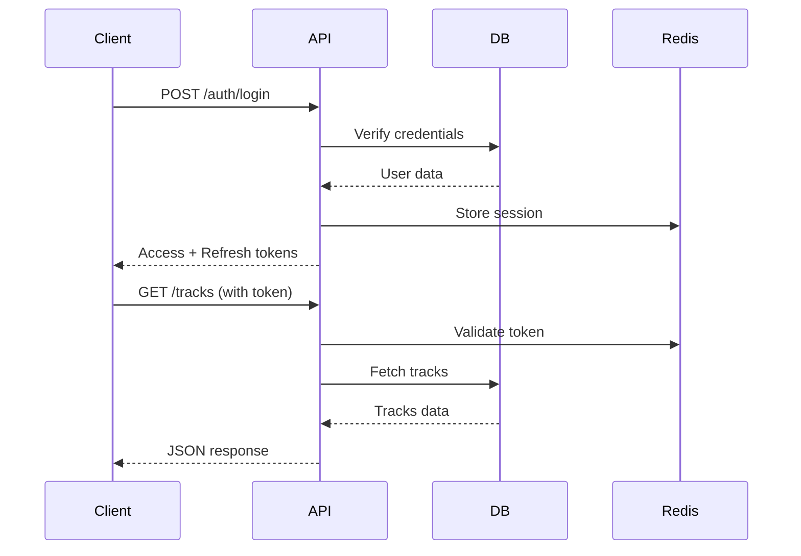
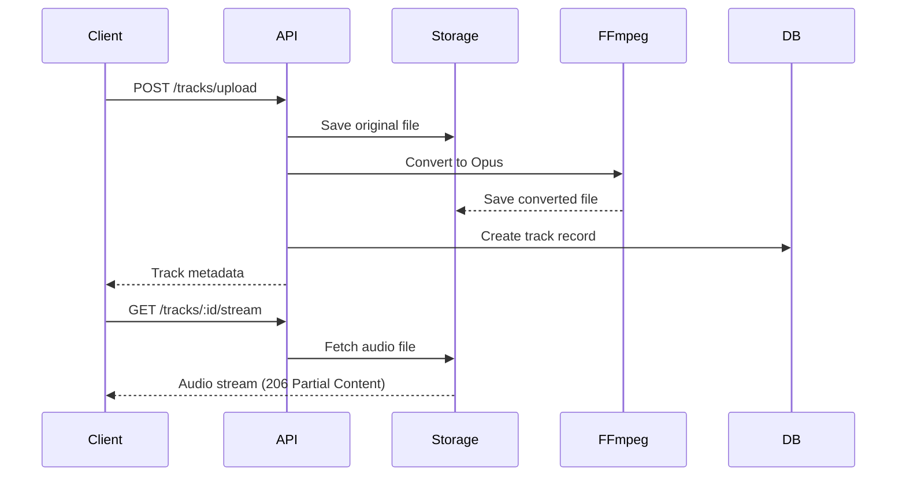
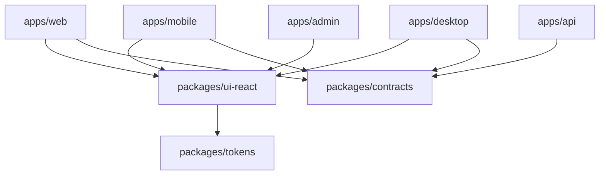
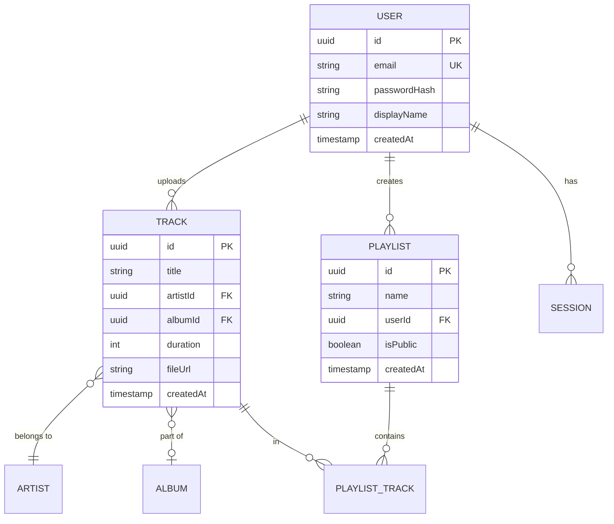
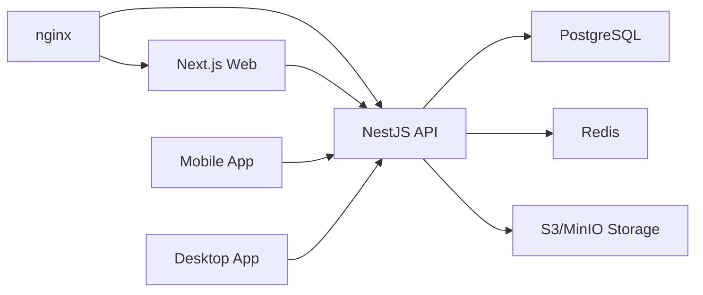

# System Architecture

Understanding the architecture of Spotify Clone - a modern monorepo application.

## 🏗️ System Architecture

Spotify Clone follows a **monorepo architecture** with clear separation of concerns:

```
spotify-clone/
├── apps/              # Applications
│   ├── api/          # Backend API (NestJS)
│   ├── web/          # Web app (Next.js)
│   ├── mobile/       # Mobile app (React Native)
│   ├── desktop/      # Desktop app (Tauri)
│   ├── admin/        # Admin panel (Kottster)
│   └── docs/         # Documentation (Docusaurus)
│
├── packages/         # Shared packages
│   ├── ui-react/    # React UI components
│   ├── contracts/   # TypeScript types & API contracts
│   ├── converter/   # Media conversion CLI
│   ├── tokens-generator/  # Design tokens
│   ├── esbuild-bundler/   # Build tooling
│   └── svgr/        # SVG to React converter
│
└── tests/           # E2E & integration tests
```

## 🎯 Design Principles

### 1. **Monorepo Structure**

All applications and packages live in a single repository, managed by **pnpm workspaces** and **Turbo**.

**Benefits:**
- Shared code across projects
- Atomic commits across multiple apps
- Centralized dependency management
- Faster CI/CD with caching

### 2. **Type Safety**

TypeScript is used throughout the entire stack:

- **@spotify/contracts** - Shared types between frontend and backend
- **Prisma** - Type-safe database access
- **tRPC-style contracts** - End-to-end type safety

### 3. **Clean Architecture**

#### Backend (NestJS)
```
src/
├── modules/          # Feature modules
│   ├── auth/
│   ├── users/
│   ├── tracks/
│   └── playlists/
├── common/           # Shared utilities
│   ├── decorators/
│   ├── guards/
│   └── filters/
└── infra/            # Infrastructure
    ├── database/
    └── config/
```

**Layers:**
- **Controllers** - HTTP handlers
- **Services** - Business logic
- **Repositories** - Data access (Prisma)
- **Entities** - Domain models

#### Frontend (Feature-Sliced Design)
```
src/
├── app/              # App initialization
├── pages/            # Next.js pages
├── widgets/          # Complex UI blocks
├── features/         # User interactions
├── entities/         # Business entities
├── shared/           # Shared utilities
└── lib/              # Infrastructure
```

## 🔄 Data Flow

### Authentication Flow



### Music Streaming Flow



## 🔌 Inter-App Communication

### Real-time Sync (WebSockets)

```typescript
// apps/api/src/gateways/audio.gateway.ts
@WebSocketGateway()
export class AudioGateway {
  @SubscribeMessage('track:play')
  handlePlay(@MessageBody() data: PlayTrackDto) {
    // Broadcast to all user's devices
    this.server.to(`user:${data.userId}`).emit('track:playing', data)
  }
}
```

### Shared Contracts

```typescript
// packages/contracts/src/dto/track.dto.ts
export interface CreateTrackDto {
  title: string
  artistId: string
  albumId?: string
  duration: number
  file: File
}

// Used in both frontend and backend
```

## 📦 Package Dependencies

### Dependency Graph



### Package Relationships

| Package | Depends On | Used By |
|---------|-----------|---------|
| `@spotify/ui-react` | `@spotify/tokens` | web, mobile, desktop, admin |
| `@spotify/contracts` | - | api, web, mobile, desktop |
| `@spotify/converter` | - | api |
| `@spotify/tokens-generator` | - | ui-react |
| `@spotify/esbuild-bundler` | - | ui-react |

## 🗄️ Database Schema

### Core Entities



## 🚀 Deployment Architecture

### Production Setup



### Container Services

- **nginx** - Reverse proxy
- **api** - NestJS backend
- **web** - Next.js frontend
- **postgres** - Primary database
- **redis** - Session store & cache
- **minio** - Object storage (S3-compatible)

## ⚡ Performance Optimizations

### Backend
- **Connection pooling** - Prisma connection management
- **Query optimization** - Database indexing
- **Caching** - Redis for sessions and frequently accessed data
- **Background jobs** - BullMQ for async tasks

### Frontend
- **Code splitting** - Next.js automatic splitting
- **Image optimization** - Next.js Image component
- **Incremental builds** - Turbo caching
- **Bundle optimization** - ESBuild for packages

### Build System
- **Turborepo** - Incremental builds with caching
- **pnpm** - Fast, disk-efficient package manager
- **ESBuild** - 10-100x faster than Webpack
- **Tailwind v4** - Rust-based, microsecond rebuilds

## 🔐 Security

### Authentication
- **JWT tokens** - Access + Refresh token pattern
- **HTTP-only cookies** - Refresh token storage
- **CORS** - Configured for specific origins
- **Rate limiting** - Prevents brute force attacks

### Data Protection
- **Password hashing** - bcrypt with salt
- **SQL injection protection** - Prisma parameterized queries
- **XSS protection** - React automatic escaping
- **CSRF protection** - Token-based validation

## 📊 Monitoring & Logging

### Application Monitoring
- **Health checks** - `/health` endpoints
- **Error tracking** - Structured logging
- **Performance metrics** - Request timing
- **Resource usage** - Memory & CPU monitoring

### Development Tools
- **Compodoc** - API documentation
- **Swagger** - Interactive API explorer
- **Storybook** - UI component catalog (planned)

## 🔄 CI/CD Pipeline

```yaml
# Simplified workflow
build → test → lint → deploy
  ↓       ↓       ↓       ↓
Docker  Jest  Biome  Production
```

See [Deployment](/deployment) for detailed CI/CD configuration.

---

Next: [Development Setup](/development) - Get your local environment ready.