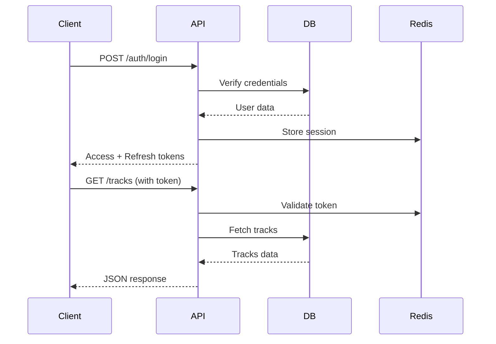
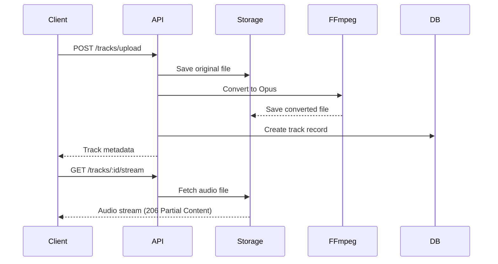
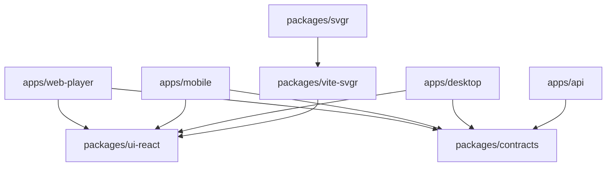
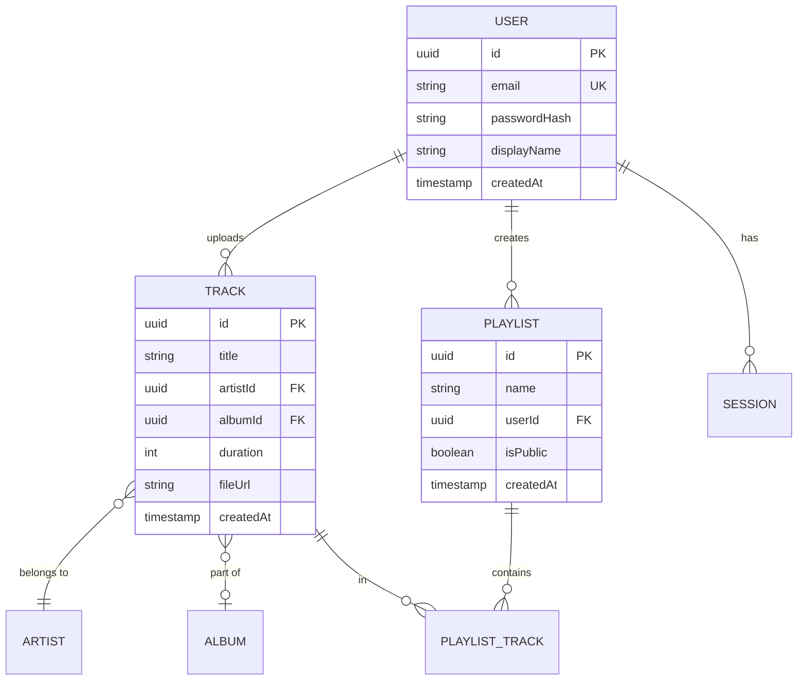
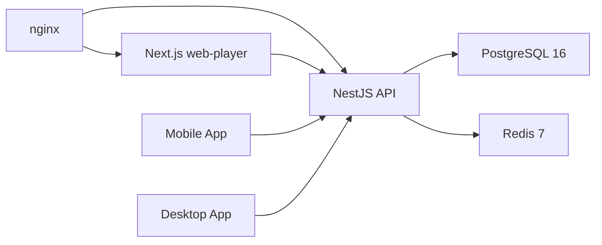

# System Architecture

Understanding the architecture of Bitrate — a modern Turborepo monorepo.

## 🏗️ Repository Structure

```
bitrate/
├── apps/              # Applications
│   ├── api/          # Backend API (NestJS)
│   ├── web-player/   # Web app (Next.js App Router, Feature-Sliced Design)
│   ├── web-artists/  # Artists web app (Next.js)
│   ├── mobile/       # Mobile app (React Native + Expo)
│   ├── desktop/      # Desktop app (Tauri 2 + React)
│   └── docs/         # Documentation (Docusaurus 3)
│
├── packages/         # Shared packages (@bitrate/ namespace)
│   ├── ui-react/         # React 19 component library (Tailwind v4, shadcn/ui, Storybook)
│   │                     #   also owns the design tokens: hand-written @theme layers
│   ├── contracts/        # OpenAPI TypeScript types (auto-generated from Swagger)
│   ├── vite-svgr/        # Vite plugin — SVG generation integrated into Vite build
│   ├── svgr/             # SVG → typed React component converter
│   ├── converter/        # Media/audio conversion utilities (FFmpeg wrapper)
│   ├── ncs-parser/       # NCS (audio format) parser
│   └── performance-test/ # K6 performance testing scenarios
│
├── infra/             # Docker Compose files + shell scripts
│   ├── docker-compose.dev.yaml      # Minimal: postgres + redis
│   ├── docker-compose.preprod.yaml  # Full dev stack
│   ├── docker-compose.prod.yaml     # Production
│   ├── nginx/           # Nginx configuration
│   └── docker-monitor.sh # health/resource/db reporting — see `task monitor:*`
│
├── scripts/           # Cross-platform helper scripts (Node.js)
├── Taskfile.yml       # Cross-platform task runner (go-task)
├── CLAUDE.md          # AI assistant guide for this codebase
└── .changeset/        # Changesets versioning config
```

## 🎯 Design Principles

### 1. Monorepo Structure

All applications and packages live in a single repository, managed by **pnpm workspaces** and **Turborepo**.

**Benefits:**
- Shared code across projects
- Atomic commits across multiple apps
- Centralized dependency management
- Faster CI/CD with Turbo caching

### 2. Type Safety

TypeScript is used throughout the entire stack:

- **@bitrate/contracts** — Shared types between frontend and backend (generated from Swagger)
- **Prisma** — Type-safe database access
- **Zod** — Runtime validation and env schema (`apps/api/env.schema.ts`)

### 3. Clean Architecture

#### Backend (NestJS)

Each feature lives in its own module under `apps/api/src/modules/<feature>/`
(controller/service/module plus decorators, DTOs, entities, errors), with
`apps/api/src/common/` and `apps/api/src/infra/` for cross-cutting utilities and
infrastructure. Path aliases: `@modules/`, `@infra/`, `@common/`, `@test/`. Three Jest test
tiers (`.unit-spec.ts`, `.int-spec.ts`, `test/e2e/**/*.e2e-spec.ts`). Full module anatomy,
the Swagger-decorator rule, and test conventions: `api-rules` (`.claude/rules/api-rules.md`)
and the `jest` skill.

#### Frontend (Feature-Sliced Design)

`apps/web-player/src/` is organized in FSD layers (`app → views → widgets → features →
entities → shared`), each importing only from the layers below it. Full layer anatomy, the
cross-layer import permission matrix, and the public-API barrel rule:
`.claude/rules/fsd-web-player.md`; the API client, state management, and component
conventions built on top of it: `web-player-rules`
(`.claude/rules/web-player-rules.md`).

**API client** (`src/shared/api/client/`):
- `fetchClient.ts` — `openapi-fetch` with automatic JWT refresh middleware
- `reactQueryClient.ts` — `openapi-react-query` wrapper

## 📐 Architecture contracts

The invariants every change is reviewed against. Each is owned by a rule file or an ADR, which is
where the reasoning lives — this list is the summary, not the source.

- **Web-player imports flow one way.** `app → views → widgets → features → entities → shared`,
  never upward, and never sideways between slices of the same layer. Biome enforces it, so a
  violation fails `pnpm lint` rather than review
  ([ADR-0002](/docs/architecture/web-player-feature-sliced-design)).
- **Next.js route files are adapters.** A `page.tsx` reads params and server data and renders a
  view from `views/`; a full screen is never composed inside the route file
  ([ADR-0010](/docs/architecture/next-routes-as-adapters)).
- **API contracts are generated, not written.** Swagger decorators produce the OpenAPI document,
  `@bitrate/contracts` is generated from it, and both web apps consume those types — so a backend
  change that breaks a frontend shows up as a type error
  ([ADR-0004](/docs/architecture/openapi-data-layer)).
- **Server state is TanStack Query; client state is per-slice Zustand.** New client state belongs
  to the slice that owns it, not to a global store
  ([ADR-0005](/docs/architecture/client-state-zustand)).
- **Shared React primitives and design tokens both live in `@bitrate/ui-react`.** The tokens are
  hand-written Tailwind `@theme` layers, not generated output
  ([ADR-0023](/docs/architecture/tokens-into-ui-react)).
- **User-facing web UI targets WCAG 2.2 AA** — semantic controls, visible focus, keyboard
  operation, reduced motion, and usable layout at 320 CSS px and 400% zoom.

## 🔄 Data Flow

### Authentication Flow


```mermaid
sequenceDiagram
    participant Client
    participant API
    participant DB
    participant Redis

    Client->>API: POST /auth/login
    API->>DB: Verify credentials
    DB-->>API: User data
    API->>Redis: Store session
    API-->>Client: Access + Refresh tokens
    Client->>API: GET /tracks (with token)
    API->>Redis: Validate token
    API->>DB: Fetch tracks
    DB-->>API: Tracks data
    API-->>Client: JSON response
```

### Music Streaming Flow


```mermaid
sequenceDiagram
    participant Client
    participant API
    participant Storage
    participant FFmpeg

    Client->>API: POST /tracks/upload
    API->>Storage: Save original file
    API->>FFmpeg: Convert to Opus
    FFmpeg-->>Storage: Save converted file
    API->>DB: Create track record
    API-->>Client: Track metadata

    Client->>API: GET /tracks/:id/stream
    API->>Storage: Fetch audio file
    Storage-->>Client: Audio stream (206 Partial Content)
```

## 📦 Package Dependencies

### Dependency Graph


```mermaid
graph TD
    A[apps/web-player] --> B[packages/ui-react]
    C[apps/mobile] --> B
    D[apps/desktop] --> B
    A --> E[packages/contracts]
    C --> E
    D --> E
    F[apps/api] --> E
    J[packages/vite-svgr] --> B
    K[packages/svgr] --> J
```

### Package Relationships

| Package | Depends On | Used By |
|---------|-----------|---------|
| `@bitrate/ui-react` | — | web-player, mobile, desktop |
| `@bitrate/contracts` | — | api, web-player, mobile, desktop |
| `@bitrate/converter` | — | api |
| `@bitrate/vite-svgr` | `@bitrate/svgr` | ui-react (build-time SVG generation) |
| `@bitrate/svgr` | — | vite-svgr |

## 🎨 Design Token Pipeline

The design values are hand-written Tailwind v4 `@theme` layers under
`packages/ui-react/src/styles/` — there is no generator and no `tokens.json`:

```
ui-react/src/styles/
  ├─ palette.css       raw colour scales
  ├─ layout.css        spacing, radii, shadows, breakpoints, z-index
  ├─ typography.css    families, sizes, weights
  └─ themes.css        barrel → themes/{base,global/*,components/*}.css
```

The default theme is declared in `@theme`; every other theme overrides the same roles under
a `:root.{name}` selector in the same part-file. See
[the design-token contract](../brand/tokens.md).


## 🗄️ Database Schema

### Core Entities


```mermaid
erDiagram
    USER ||--o{ TRACK : uploads
    USER ||--o{ PLAYLIST : creates
    USER ||--o{ SESSION : has
    TRACK }o--|| ARTIST : "belongs to"
    TRACK }o--o| ALBUM : "part of"
    PLAYLIST ||--o{ PLAYLIST_TRACK : contains
    TRACK ||--o{ PLAYLIST_TRACK : "in"

    USER {
        uuid id PK
        string email UK
        string passwordHash
        string displayName
        timestamp createdAt
    }

    TRACK {
        uuid id PK
        string title
        uuid artistId FK
        uuid albumId FK
        int duration
        string fileUrl
        timestamp createdAt
    }

    PLAYLIST {
        uuid id PK
        string name
        uuid userId FK
        boolean isPublic
        timestamp createdAt
    }
```

## 🚀 Deployment Architecture

### Production Setup


```mermaid
graph LR
    A[nginx] --> B[Next.js web-player]
    A --> C[NestJS API]
    C --> D[PostgreSQL 16]
    C --> E[Redis 7]
    B --> C
    G[Mobile App] --> C
    H[Desktop App] --> C
```

### Container Services (`docker-compose.prod.yaml`)

- **nginx** — Reverse proxy (ports 80/443)
- **api** — NestJS backend (port 3000)
- **web** — Next.js web-player (port 3001)
- **postgres** — Primary database (port 5432)
- **redis** — Session store & cache (port 6379)

## ⚡ Performance Optimizations

### Backend
- **Connection pooling** — Prisma connection management
- **Query optimization** — Database indexing
- **Caching** — Redis for sessions and frequently accessed data
- **Background jobs** — BullMQ for async tasks (track processing, emails)

### Frontend
- **Code splitting** — Next.js automatic splitting
- **Image optimization** — Next.js Image component
- **Incremental builds** — Turbo caching
- **Bundle optimization** — Vite library mode for packages

### Build System
- **Turborepo** — Incremental builds with remote caching
- **pnpm** — Fast, disk-efficient package manager
- **Vite** — Fast library builds with Rollup, watch mode, dev server integration
- **Tailwind v4** — Rust-based, microsecond rebuilds

## 🔐 Security

### Authentication
- **JWT tokens** — Access + Refresh token pattern
- **HTTP-only cookies** — Refresh token storage
- **CORS** — Configured for specific origins
- **Rate limiting** — Prevents brute force attacks
- **2FA** — TOTP-based two-factor authentication
- **OAuth 2.0** — Google, Facebook, Discord

### Data Protection
- **Password hashing** — SHA-3
- **SQL injection protection** — Prisma parameterized queries
- **XSS protection** — React automatic escaping + CSP
- **CSRF protection** — Token-based validation
- **Helmet** — Security HTTP headers

## 📊 Monitoring & Logging

### Application Monitoring
- **Health checks** — `/health` endpoints
- **Error tracking** — Sentry
- **Structured logging** — nestjs-pino
- **Metrics** — Prometheus + Grafana

### Development Tools
- **Swagger** — Interactive API explorer at `/swagger`
- **Prisma Studio** — Database GUI
- **Storybook** — UI component catalog (port 6006)

## 🔄 CI/CD Pipeline

20+ GitHub Actions workflows in `.github/workflows/`:

- Per-app workflows: `api.yml`, `web_player.yml`, `mobile.yml`, `desktop.yml`
- Shared reusable workflows: `*_reusable.yml`
- Cross-cutting: `monitoring.yml`, `security.yml`, `performance.yml`, `release.yml`

```
push/PR → build → test → lint → type-check → deploy
```

See `.github/workflows/README.md` for detailed CI/CD documentation.

## 📦 Versioning

The project uses **Changesets** for version management:

```bash
pnpm changeset          # describe change, select bump type
pnpm changeset:version  # apply changesets → bump versions + CHANGELOG
```

Releasing is a chain rather than a single action, and it runs on `master`, not `develop`.
Merging into `master` triggers `release.yml`, which consumes the pending changesets, bumps every
changed workspace, writes its `CHANGELOG.md`, commits `chore(release): version packages` back to
`master` and tags each bump. That commit is what the image builds react to, and the deploy then
waits for one manual approval — see [Deployment](/docs/infrastructure/deployment).

---

Next: [Development Setup](/docs/getting-started/setup) — Get your local environment ready.
