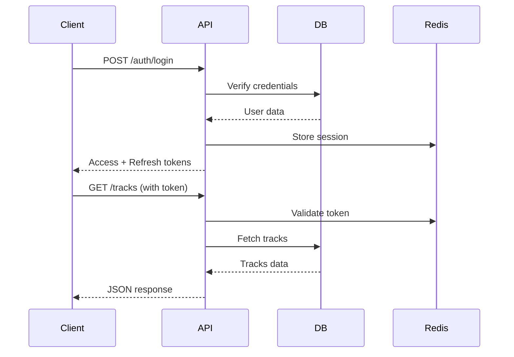
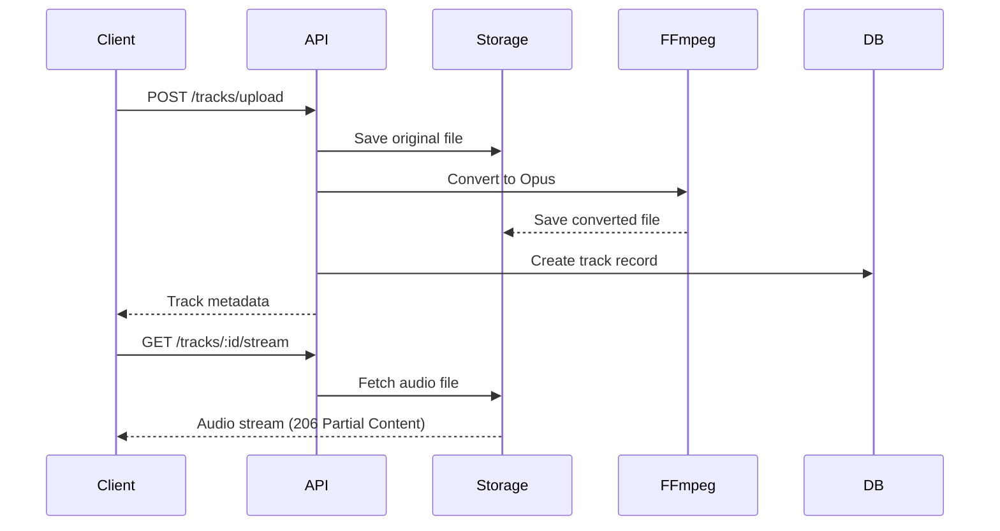
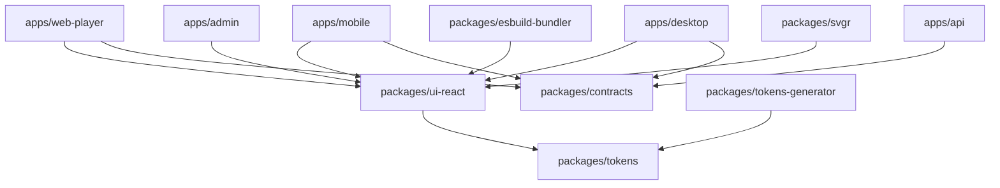
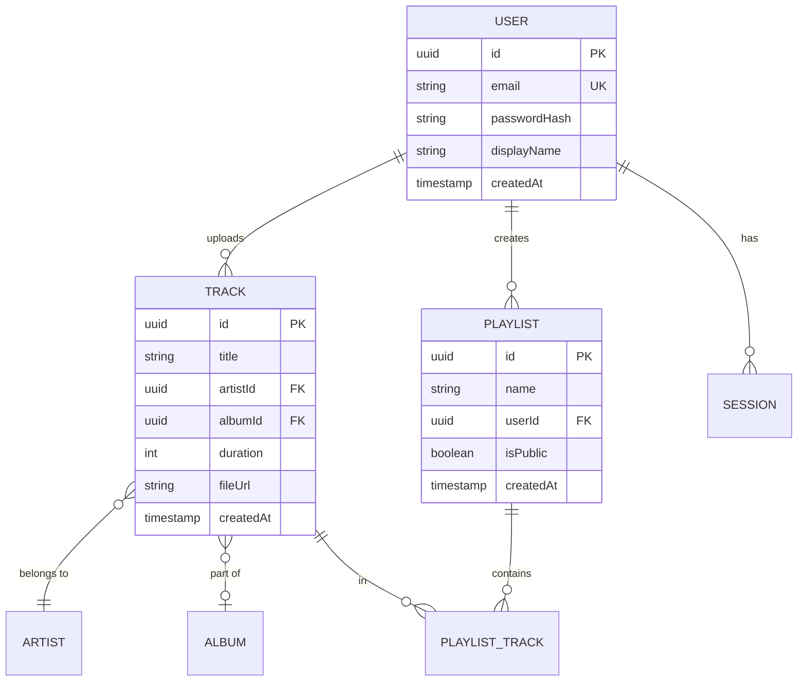
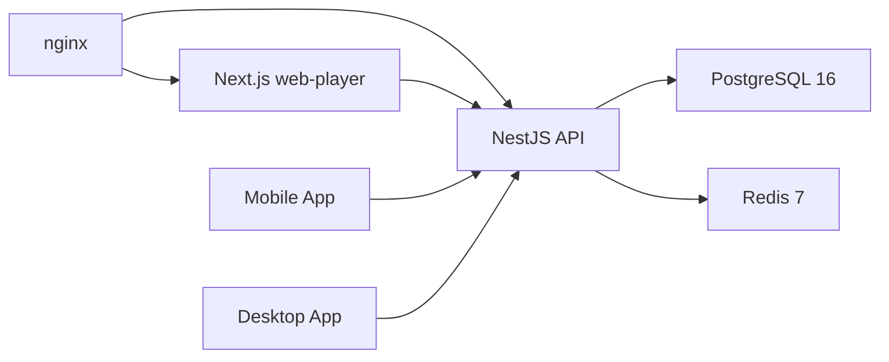

# System Architecture

Understanding the architecture of Spotify Clone — a modern Turborepo monorepo.

## 🏗️ Repository Structure

```
spotify-clone/
├── apps/              # Applications
│   ├── api/          # Backend API (NestJS)
│   ├── web-player/   # Web app (Next.js 15, Feature-Sliced Design)
│   ├── web-artists/  # Artists web app (Next.js)
│   ├── mobile/       # Mobile app (React Native + Expo)
│   ├── desktop/      # Desktop app (Tauri 2 + React)
│   ├── admin/        # Admin panel (Kottster)
│   └── docs/         # Documentation (Mintlify)
│
├── packages/         # Shared packages (@spotify/ namespace)
│   ├── ui-react/         # React 19 component library (Tailwind v4, shadcn/ui, Storybook)
│   ├── tokens/           # Design tokens (tokens.json) + SVG icons source
│   ├── tokens-generator/ # CLI: tokens.json → CSS files
│   ├── contracts/        # OpenAPI TypeScript types (auto-generated from Swagger)
│   ├── esbuild-bundler/  # ESBuild wrapper (dual ESM/CJS output for ui-react)
│   ├── svgr/             # SVG → typed React component converter
│   ├── converter/        # Media/audio conversion utilities (FFmpeg wrapper)
│   ├── ncs-parser/       # NCS (audio format) parser
│   ├── ui-flutter/       # Flutter UI components
│   └── load-test/        # Load testing utilities
│
├── infra/             # Docker Compose files + shell scripts
│   ├── docker-compose.dev.yaml      # Minimal: postgres + redis
│   ├── docker-compose.preprod.yaml  # Full dev stack
│   ├── docker-compose.prod.yaml     # Production
│   ├── nginx/           # Nginx configuration
│   ├── docker-manage.sh
│   └── docker-monitor.sh
│
├── scripts/           # Cross-platform helper scripts (Node.js)
├── Taskfile.yml       # Cross-platform task runner (go-task)
├── CLAUDE.md          # AI assistant guide for this codebase
└── .changeset/        # Changesets versioning config
```

## 🎯 Design Principles

### 1. Monorepo Structure

All applications and packages live in a single repository, managed by **pnpm workspaces** and **Turborepo**.

**Benefits:**
- Shared code across projects
- Atomic commits across multiple apps
- Centralized dependency management
- Faster CI/CD with Turbo caching

### 2. Type Safety

TypeScript is used throughout the entire stack:

- **@spotify/contracts** — Shared types between frontend and backend (generated from Swagger)
- **Prisma** — Type-safe database access
- **Zod** — Runtime validation and env schema (`apps/api/env.schema.ts`)

### 3. Clean Architecture

#### Backend (NestJS)

```
apps/api/src/
├── modules/          # Feature modules (auth, users, tracks, playlists…)
│   └── <feature>/
│       ├── <feature>.controller.ts
│       ├── <feature>.service.ts
│       └── <feature>.module.ts
├── common/           # Shared utilities (decorators, guards, filters)
└── infra/            # Infrastructure (database, config)
```

Path aliases: `@modules/`, `@infra/`

**Three test tiers:**
- `*.spec.ts` — Unit (mocked Prisma + services)
- `*.int-spec.ts` — Integration (real Prisma + test DB, in-process)
- `test/e2e/**/*.e2e-spec.ts` — E2E (HTTP against running API)

#### Frontend (Feature-Sliced Design)

```
apps/web-player/src/
├── app/              # Next.js App Router pages & layouts
├── views/            # Full-page view compositions
├── widgets/          # Self-contained page sections (Header, Player, LeftSidebar…)
├── features/         # User interactions (Album, Playlist, AuthModal…)
├── entities/         # Domain objects (Track, User, Player…)
└── shared/           # Cross-cutting utilities
    ├── api/          # openapi-fetch client + openapi-react-query wrapper
    ├── hooks/
    ├── store/
    ├── ui/
    ├── routes/
    ├── constants/
    └── validation/
```

**API client** (`src/shared/api/client/`):
- `fetchClient.ts` — `openapi-fetch` with automatic JWT refresh middleware
- `reactQueryClient.ts` — `openapi-react-query` wrapper

## 🔄 Data Flow

### Authentication Flow


```mermaid
sequenceDiagram
    participant Client
    participant API
    participant DB
    participant Redis

    Client->>API: POST /auth/login
    API->>DB: Verify credentials
    DB-->>API: User data
    API->>Redis: Store session
    API-->>Client: Access + Refresh tokens
    Client->>API: GET /tracks (with token)
    API->>Redis: Validate token
    API->>DB: Fetch tracks
    DB-->>API: Tracks data
    API-->>Client: JSON response
```

### Music Streaming Flow


```mermaid
sequenceDiagram
    participant Client
    participant API
    participant Storage
    participant FFmpeg

    Client->>API: POST /tracks/upload
    API->>Storage: Save original file
    API->>FFmpeg: Convert to Opus
    FFmpeg-->>Storage: Save converted file
    API->>DB: Create track record
    API-->>Client: Track metadata

    Client->>API: GET /tracks/:id/stream
    API->>Storage: Fetch audio file
    Storage-->>Client: Audio stream (206 Partial Content)
```

## 📦 Package Dependencies

### Dependency Graph


```mermaid
graph TD
    A[apps/web-player] --> B[packages/ui-react]
    C[apps/mobile] --> B
    D[apps/desktop] --> B
    A --> E[packages/contracts]
    C --> E
    D --> E
    F[apps/api] --> E
    G[apps/admin] --> B
    B --> H[packages/tokens]
    I[packages/tokens-generator] --> H
    J[packages/esbuild-bundler] --> B
    K[packages/svgr] --> B
```

### Package Relationships

| Package | Depends On | Used By |
|---------|-----------|---------|
| `@spotify/ui-react` | `@spotify/tokens` | web-player, mobile, desktop, admin |
| `@spotify/contracts` | — | api, web-player, mobile, desktop |
| `@spotify/converter` | — | api |
| `@spotify/tokens-generator` | — | ui-react (via gen:tokens script) |
| `@spotify/esbuild-bundler` | — | ui-react (build system) |
| `@spotify/svgr` | — | ui-react (icon generation) |

## 🎨 Design Token Pipeline

`packages/tokens/tokens.json` is the single source of truth for all design values:

```
tokens.json
  └─▶ @spotify/tokens-generator (CLI)
        ├─▶ ui-react/src/styles/palette.css
        ├─▶ ui-react/src/styles/layout.css
        ├─▶ ui-react/src/styles/typography.css
        └─▶ ui-react/src/styles/themes.css  ← @theme + :root.{theme} selectors
```

CSS files use Tailwind v4 `@theme` blocks. First theme becomes the default (`@theme`); additional themes get `:root.{name}` selectors.

Regenerate after editing `tokens.json`:
```bash
pnpm --filter @spotify/ui-react gen:tokens
```

## 🗄️ Database Schema

### Core Entities


```mermaid
erDiagram
    USER ||--o{ TRACK : uploads
    USER ||--o{ PLAYLIST : creates
    USER ||--o{ SESSION : has
    TRACK }o--|| ARTIST : "belongs to"
    TRACK }o--o| ALBUM : "part of"
    PLAYLIST ||--o{ PLAYLIST_TRACK : contains
    TRACK ||--o{ PLAYLIST_TRACK : "in"

    USER {
        uuid id PK
        string email UK
        string passwordHash
        string displayName
        timestamp createdAt
    }

    TRACK {
        uuid id PK
        string title
        uuid artistId FK
        uuid albumId FK
        int duration
        string fileUrl
        timestamp createdAt
    }

    PLAYLIST {
        uuid id PK
        string name
        uuid userId FK
        boolean isPublic
        timestamp createdAt
    }
```

## 🚀 Deployment Architecture

### Production Setup


```mermaid
graph LR
    A[nginx] --> B[Next.js web-player]
    A --> C[NestJS API]
    C --> D[PostgreSQL 16]
    C --> E[Redis 7]
    B --> C
    G[Mobile App] --> C
    H[Desktop App] --> C
```

### Container Services (`docker-compose.prod.yaml`)

- **nginx** — Reverse proxy (ports 80/443)
- **api** — NestJS backend (port 3000)
- **web** — Next.js web-player (port 3001)
- **admin** — Admin panel (port 3002)
- **postgres** — Primary database (port 5432)
- **redis** — Session store & cache (port 6379)

## ⚡ Performance Optimizations

### Backend
- **Connection pooling** — Prisma connection management
- **Query optimization** — Database indexing
- **Caching** — Redis for sessions and frequently accessed data
- **Background jobs** — BullMQ for async tasks (track processing, emails)

### Frontend
- **Code splitting** — Next.js automatic splitting
- **Image optimization** — Next.js Image component
- **Incremental builds** — Turbo caching
- **Bundle optimization** — ESBuild for packages

### Build System
- **Turborepo** — Incremental builds with remote caching
- **pnpm** — Fast, disk-efficient package manager
- **ESBuild** — 10-100x faster than Webpack
- **Tailwind v4** — Rust-based, microsecond rebuilds

## 🔐 Security

### Authentication
- **JWT tokens** — Access + Refresh token pattern
- **HTTP-only cookies** — Refresh token storage
- **CORS** — Configured for specific origins
- **Rate limiting** — Prevents brute force attacks
- **2FA** — TOTP-based two-factor authentication
- **OAuth 2.0** — Google, Facebook, Discord

### Data Protection
- **Password hashing** — SHA-3
- **SQL injection protection** — Prisma parameterized queries
- **XSS protection** — React automatic escaping + CSP
- **CSRF protection** — Token-based validation
- **Helmet** — Security HTTP headers

## 📊 Monitoring & Logging

### Application Monitoring
- **Health checks** — `/health` endpoints
- **Error tracking** — Sentry
- **Structured logging** — nestjs-pino
- **Metrics** — Prometheus + Grafana

### Development Tools
- **Swagger** — Interactive API explorer at `/swagger`
- **Prisma Studio** — Database GUI
- **Storybook** — UI component catalog (port 6006)

## 🔄 CI/CD Pipeline

20+ GitHub Actions workflows in `.github/workflows/`:

- Per-app workflows: `api.yml`, `web_player.yml`, `mobile.yml`, `desktop.yml`, `admin.yml`
- Shared reusable workflows: `*_reusable.yml`
- Cross-cutting: `monitoring.yml`, `security.yml`, `performance.yml`, `release.yml`

```
push/PR → build → test → lint → type-check → deploy
```

See `.github/workflows/README.md` for detailed CI/CD documentation.

## 📦 Versioning

The project uses **Changesets** for version management:

```bash
pnpm changeset          # describe change, select bump type
pnpm changeset:version  # apply changesets → bump versions + CHANGELOG
```

The `release.yml` GitHub Action creates "Version Packages" PRs automatically on push to `develop`.

---

Next: [Development Setup](/docs/getting-started/setup) — Get your local environment ready.
