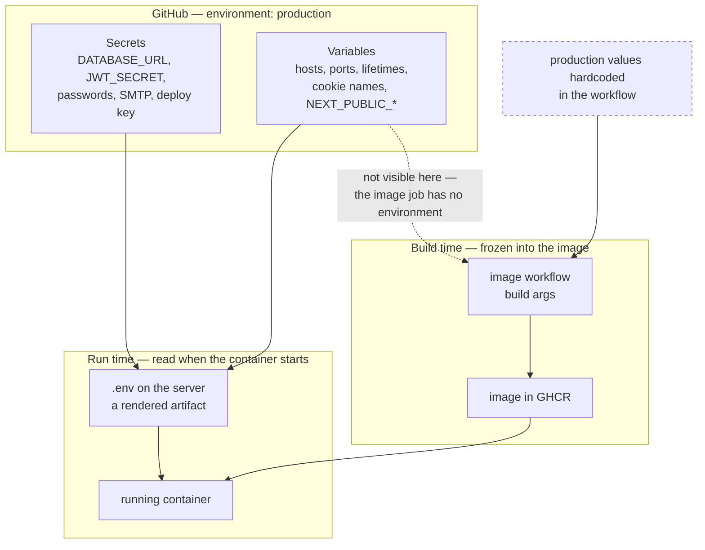
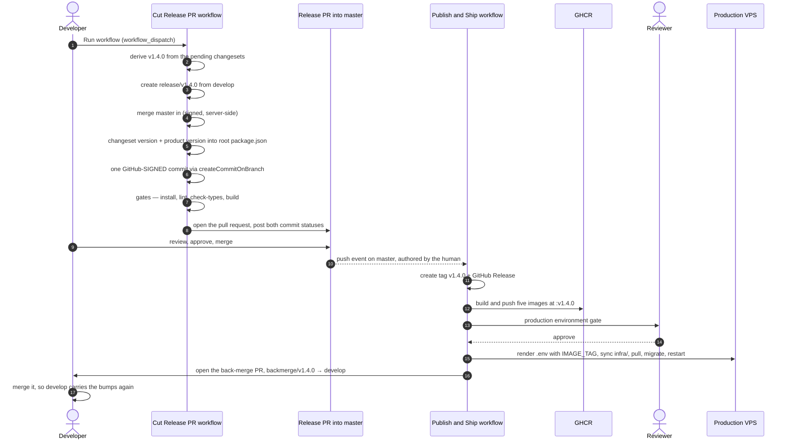

# Deployment

Deploying Bitrate to a single Linux server with Docker Compose.

This is the only deployment path the repository actually supports. Earlier revisions of this
page also described Elastic Beanstalk, Cloud Run, Azure Container Instances, and Kubernetes;
none of them had configuration in the repository, so the instructions could not work. They
were removed rather than left as an untested promise.

## What you are deploying

`infra/docker-compose.prod.yaml` runs eight containers behind one nginx, the only one that
publishes ports:

| Container | Role | Host it serves |
|---|---|---|
| `nginx` | TLS termination and routing | all of them — 80, 443 |
| `web-player` | Next.js, port 3001 | the apex, and `www` by redirect |
| `web-artists` | Next.js, port 3002 | `artists.` |
| `api` | NestJS, port 3000 | `api.` |
| `docs` | Docusaurus build on nginx, port 8080 | `docs.` |
| `storybook` | Storybook build on nginx, port 8080 | `ui.` |
| `postgres` | PostgreSQL 16 | — |
| `redis` | Redis 7 | — |

One host, one application; there are no path routes between them. Both frontends request their
build output from `/_next/`, so serving them under paths on a single host made the portal's assets
resolve against the player.


The dotted edges are the part that catches people out: a page served from the apex does not reach
the API through its own origin. The browser calls `api.bitrate.me`, which is why that origin is
compiled into the frontend bundles and why CORS has to allow it.

Only nginx publishes ports. Postgres and Redis are reachable only inside the Docker network —
do not add a `ports:` mapping to them.

## Sizing

`api`, `web-player` and `web-artists` are capped at 512 MB each, `docs` and `storybook` at 128 MB, so the stack idles at roughly 3 GB
including Postgres, Redis, nginx, and the OS. **8 GB is the practical floor**, because the
production compose builds images on the server and two parallel Next.js builds can ask for more
than the idle stack leaves free.

Audio transcoding (ffmpeg, via the BullMQ consumer in `apps/api`) is the only CPU-heavy work.
Four cores is comfortable for a small deployment.

## Prerequisites

- Docker Engine with the Compose plugin
- [`task`](https://taskfile.dev/installation/) — the only supported interface to the Docker and
  database workflows in this repository
- A domain pointing at the server's IP

Node and pnpm are **not** needed on the host; everything is built inside containers.

## 1. Harden the server

Before anything else:

```bash
# key-only SSH
sudo sed -i 's/^#\?PasswordAuthentication.*/PasswordAuthentication no/' /etc/ssh/sshd_config
sudo systemctl reload ssh

# only SSH and the web ports
sudo ufw allow OpenSSH && sudo ufw allow 80,443/tcp && sudo ufw enable

sudo apt install -y fail2ban unattended-upgrades
```

Run the stack as a non-root user in the `docker` group, not as root.

### Swap

Images are built in CI, not here — swap matters for the running stack, not for a build. On
an 8 GB machine that can exhaust memory mid-build:

```bash
sudo fallocate -l 4G /swapfile && sudo chmod 600 /swapfile
sudo mkswap /swapfile && sudo swapon /swapfile
echo '/swapfile none swap sw 0 0' | sudo tee -a /etc/fstab
```

## 2. Clone and configure

```bash
git clone https://github.com/Lordpluha/bitrate.git
cd bitrate
cp .env.example .env
```

Edit the **root** `.env` — not `apps/api/.env`. The compose stacks read only the repository
root, and `.dockerignore` keeps per-app env files out of the image entirely, so a value placed
in one is silently ignored. See [Environment variables](../guides/environment.md) for which file
is read when.

Use `task` rather than calling `docker compose` by hand. Compose looks for `.env` beside the
compose file, so a bare `docker compose -f infra/docker-compose.prod.yaml` reads `infra/.env`,
finds nothing, and resolves every variable to an empty string without saying so. The `task`
targets pass `--env-file .env` explicitly.

### Where production configuration actually lives

The server's `.env` is a rendered artifact, not the source. The deploy workflow writes it from
GitHub, so editing it by hand on the server works only until the next deploy overwrites it.

| Kind | Stored as | Holds |
|---|---|---|
| Secret | **environment** secret | `POSTGRES_PASSWORD`, `REDIS_PASSWORD`, `JWT_SECRET`, `DATABASE_URL`, `SMTP_USER`, `SMTP_PASS`, both OAuth client secrets, `METRICS_TOKEN`, `SENTRY_DSN`, `DEPLOY_SSH_KEY` |
| Configuration | **environment** variable | hosts, ports, token lifetimes, cookie names, `STORAGE_DRIVER`, both OAuth client ids, `DEPLOY_HOST`, `DEPLOY_USER` |

`NEXT_PUBLIC_*` belong in the variable column on purpose: they are compiled into a client bundle
that any visitor can read, so storing them as secrets protects nothing and only makes them harder
to change.

Both live on the **`production` environment**, not at repository scope, because the same names hold
different values per deployment target. Adding `staging` is then a second environment plus a caller
that passes its name — the reusable workflow itself does not change.

A leftover repository-scoped copy is not an error, which is precisely what makes it dangerous: an
environment-bound job reads repository scope too, and environment only wins on a name collision. The
stale copy would quietly apply to every environment that has not defined its own value. Delete it
rather than leaving it.

The caller passes `secrets: inherit` rather than mapping each secret. It has no choice: GitHub does
not allow `environment:` on a job that calls a reusable workflow, so an explicit
`${{ secrets.X }}` mapping there would be evaluated outside the environment and pass empty strings —
a deploy that succeeds while starting the API with a blank signing key. The cost of `inherit` is
real: every repository secret becomes visible to the called workflow.

One seam to know about. `NEXT_PUBLIC_API_URL`, `NEXT_PUBLIC_SITE_URL` and `API_URL` are also read by
the image-build workflows, which have no environment and therefore fall back to the production
values hardcoded in them. Production is unaffected — the fallbacks match — but the image side is a
separate axis from the server's `.env`, and changing the environment variable will not change a
published bundle.



Read the dotted edge as the rule it is: **changing a variable changes the server's next `.env`, not
any image that has already been built.** A frontend's API origin is decided by the workflow's build
args and frozen when the image is made; no amount of editing configuration afterwards moves it. The
only way to change it is to rebuild.

The same asymmetry explains why editing `.env` on the server looks like it works and then quietly
stops working: the next deploy overwrites the file from GitHub.

`scripts/sync-env-to-github.sh` uploads an existing env file in one pass. It pipes each value into
`gh` on stdin rather than passing it as an argument — arguments are visible to anyone who can run
`ps` — prints names only, and lists any name its classification does not cover, since such a name
would silently vanish from the rendered file.

```bash
./scripts/sync-env-to-github.sh                      # dry run against production
./scripts/sync-env-to-github.sh --apply
./scripts/sync-env-to-github.sh --env staging --apply
```

The environment must exist first, and its required reviewer has to be added by hand — `gh` can
create neither. After writing, the script re-reads the environment and names anything that did not
land: a missing required value aborts the next deploy loudly, but a missing optional one just
reverts to a schema default without saying so.

A compose `--env-file` is not a shell file: compose interpolates `${...}` inside it and treats
` #` as the start of a comment, so a password containing `$` or ` #` is corrupted rather than
rejected. The deploy's preflight fails by name on those characters — regenerate the credential
without them rather than trying to escape it.

The API validates its environment at startup with Zod (`apps/api/env.schema.ts`) and refuses to
boot with a message naming what is missing — so start the stack and read the error rather than
guessing.

Four values need attention:

```bash
# Generate, do not invent
JWT_SECRET=$(openssl rand -base64 48)

# The API sits behind exactly one proxy hop (nginx). Leaving this at 0 makes rate limiting
# and audit logs see nginx's address for every request, which disables brute-force protection.
TRUST_PROXY_HOPS=1

# Must match the certificate issued below, or nginx will not start
DOMAIN=example.com

# Validated as URLs
WEB_HOST=https://example.com
USER_WEB_HOST=https://example.com
ARTIST_WEB_HOST=https://example.com/artists
API_BASE_URL=https://example.com/api
```

`OAUTH_*`, `SMTP_*`, `SENTRY_DSN`, and `METRICS_TOKEN` are optional — the API starts without
them. `EMAIL_FROM` becomes required as soon as `SMTP_HOST` is set.

## 3. Issue the TLS certificate

nginx serves the ACME challenge from `infra/nginx/certbot-webroot`, so the first certificate is
issued before nginx has a certificate to start with. Use standalone mode once, then webroot for
renewals:

```bash
sudo apt install -y certbot
sudo certbot certonly --standalone -d example.com -d www.example.com \
  -d artists.example.com -d api.example.com -d docs.example.com -d ui.example.com \
  --agree-tos -m you@example.com
```

Every name the template declares a server block for. A certificate that omits one means nginx
cannot present a valid certificate for that host.

If the domain sits behind a proxy such as Cloudflare, set these names to DNS-only first. A proxied
name terminates TLS at the edge under the proxy's own certificate, so the origin's never reaches
the visitor and the HTTP-01 challenge is answered by whatever the proxy decides to forward.

The portal needs a separate host rather than a path under the main domain because neither Next.js
app sets `basePath` — both request their build output from `/_next/…`, so under path routing the
portal's assets resolve against the web player, which does not have them.

Certificates land in `/etc/letsencrypt/live/<domain>/`, which the nginx container mounts
read-only. Renewal runs from certbot's own systemd timer; point it at the webroot so it does not
need to stop nginx:

```bash
sudo certbot certonly --webroot -w /path/to/bitrate/infra/nginx/certbot-webroot -d example.com
```

Renewal must use webroot, not standalone: nginx holds port 80, so a standalone renewal cannot
bind it. nginx also caches the certificate at startup and has to be told to re-read it, so the
renewal and the reload belong in one script:

```sh
#!/bin/sh
set -e
docker run --rm \
  -v /etc/letsencrypt:/etc/letsencrypt \
  -v /var/lib/letsencrypt:/var/lib/letsencrypt \
  -v "$HOME/bitrate/infra/nginx/certbot-webroot:/var/www/certbot" \
  certbot/certbot renew --webroot -w /var/www/certbot --quiet
docker exec bitrate-nginx-prod nginx -s reload 2>/dev/null || true
```

Run it weekly from the deploying user's crontab — Docker group membership is enough, no root
required. Verify the whole path with `--dry-run` before trusting it.

## 4. First deploy

```bash
task prod:deploy
```

That pulls the images CI publishes and starts them. Build on the server only when you need
something CI has not published yet:

```bash
task prod:build
```

If the build is killed for memory, build one package at a time:

```bash
COMPOSE_PARALLEL_LIMIT=1 docker compose --env-file .env -f infra/docker-compose.prod.yaml build
```

Compose v2 has no `--parallel` flag — that was v1. And `--env-file` is not optional here for the
reason given two sections above.

Then apply migrations and seed:

```bash
task prod:migrate
```

There is no production seed. The seed script runs through `ts-node` and generates its content
with `@faker-js/faker`, both devDependencies that the production image deliberately omits — and
filling a live catalogue with generated artists is not something to do by accident. A production
database starts empty.

Not `task db:migrate` — that targets the preprod stack and runs `prisma migrate dev`, which
generates migrations, wants a shadow database, and can reset the data it is pointed at.
`prod:migrate` runs `migrate deploy` against the production stack.

## 5. Verify

```bash
task prod:logs                     # all services
curl -f https://example.com/health # nginx
curl -f https://api.example.com/api/v1/health/ready
```

If nginx exits immediately, the usual causes are a `DOMAIN` that does not match the issued
certificate, or a missing certificate at `/etc/letsencrypt/live/<DOMAIN>/`.

## 6. Backups

```bash
task db:backup                     # dump to backups/
task db:restore FILE=backups/2026-09-02_120000.sql
```

`db:restore` is destructive and asks for confirmation. Copy dumps off the machine — a snapshot
of a volume with a running Postgres is not a consistent backup, so volume snapshots are a second
line of defence, not a substitute.

## 7. Releasing

A release is one pull request. Changesets accumulate on `develop`; a workflow cuts them onto a
short-lived release branch and opens that branch as a pull request into `master`; **your merge of
that pull request is what triggers everything else.** A merge performed on github.com is
authenticated as the person who clicked it, so the push to `master` it produces raises a push event
and starts the builds. Nothing in the chain needs a personal access token or a GitHub App.

### One-time setup

Two things a workflow cannot do for itself, both requiring repository admin.

**Register the release checks as required on `master`.** The cut posts its results as commit
statuses, and branch protection matches required checks by *context name*. Until they are
registered, nothing stops a release pull request merging with a failed gate:

```bash
pnpm check:branch-protection            # report only — shows what would change
pnpm check:branch-protection --apply    # register them
```

That adds exactly two contexts, `bitrate/release-gates` and `bitrate/release-version`, and touches
no other protection setting. **The GitHub UI cannot do this**: its picker only offers checks it has
seen in the last seven days, and these have never run. The script uses the API, which has no such
restriction.

**Give the `production` environment a required reviewer.** `environment: production` in a workflow
blocks nothing by itself. Go to **Settings → Environments → production** and add one, or the deploy
runs unattended.

Two things you should *not* do:

- **Do not tick "Require deployments to succeed before merging"** for `production` on `master`. The
  deploy runs *after* the release pull request merges, so the pull request would wait forever on a
  deployment only its own merge can start.
- **Do not add a branch protection rule for `release/*`.** One with "Allow deletions" unchecked
  makes release branches undeletable, so every finished release leaves permanent litter and the
  cut's "this branch already exists" guard starts blocking re-cuts.

### The shape



### The release commit is signed, and that is not decoration

`master` and `develop` both have **Require signed commits** on. A commit made by `git commit` on a
CI runner is unsigned, and a pull request containing one is refused at the merge button with:

```text
Commits must have verified signatures.
```

So the cut never runs `git commit`. It creates the version commit through GitHub's GraphQL
`createCommitOnBranch` mutation and merges `master` in through `POST /repos/{owner}/{repo}/merges`,
both of which GitHub signs with its own key. You will see the release commit attributed to
`github-actions[bot]` with a green **Verified** badge.

The practical consequence for you: **all three merge strategies work.** Merge, squash and rebase are
equivalent here, and nothing downstream depends on which you pick.

### The branch is kept up to date for you

`master` has **Require branches to be up to date before merging** on, so a release branch that does
not contain `master`'s tip cannot merge. The cut merges `master` into the release branch as part of
cutting it, so a fresh cut is always mergeable. If `master` and `develop` have genuinely diverged
the cut fails loudly rather than guessing a resolution — reconcile them in their own pull request
and cut again.

One case is left to you, because it happens after the cut: if something lands on `master` while the
release pull request is open, GitHub shows **Update branch**. Clicking it is safe — GitHub creates
another signed merge commit — but it makes *you* the last pusher, and `require_last_push_approval`
then needs somebody else's approval. Unless a second reviewer is handy, the cleaner recovery is to
close the pull request, delete the release branch, land the `master` change into `develop`, and
re-cut.

### The version is derived, never typed

The release is tagged with the **product's semantic version** — `v1.4.0` — and that version follows
from what the release actually contains. The rule is one line: the product bumps by the **highest
bump type present among the workspaces this release versions**. Any `major` in the pending
changesets makes it a major release; otherwise any `minor` makes it a minor one; otherwise it is a
patch.

The cut workflow reads that from Changesets rather than from anyone's judgement:

```bash
pnpm exec changeset status --output status.json
jq -r '[.changesets[].releases[].type]
       | if index("major") then "major"
         elif index("minor") then "minor"
         elif index("patch") then "patch"
         else "none" end' status.json
```

You can run exactly that locally to see what the next release would be called, without starting one.

`.changesets[]` — the bumps a person actually **wrote** — and not `.releases[]`, which is Changesets'
resolved plan and also contains the patch bumps it generates for *dependents*. Deriving from the
resolved plan would let a change travel along a dependency edge and inflate the product version.

If it resolves to `none` — or there are no changesets — the run **fails**. It never falls through to
`patch`, because a patch release naming changes it does not contain is worse than no release.

The product version lives in the **root `package.json`**'s `version` field. The root package is
outside `pnpm-workspace.yaml`'s `apps/*` and `packages/*` globs, so Changesets never touches it and
cannot fight the release workflow over it.

### Package versions move independently

The product version is a separate axis from the per-workspace versions. Packages are **not**
versioned in lockstep: `.changeset/config.json` sets `fixed: []` and `linked: []`, so nothing is
forced to move with anything else.

Worked example — **you change only the UI kit** and write one `minor` changeset for
`@bitrate/ui-react`:

| Workspace | Before | After | Why |
|---|---|---|---|
| `@bitrate/ui-react` | 0.0.2 | **0.1.0** | the bump you wrote |
| `@bitrate/web-player` | 0.1.0 | **0.1.1** | it bundles `ui-react`, so its image genuinely changed |
| `@bitrate/web-artists` | 0.1.1 | **0.1.2** | same |
| `@bitrate/api` | 0.1.0 | 0.1.0 | depends on `converter`, `ncs-parser`, `contracts` — not on `ui-react` |
| `@bitrate/docs`, `mobile`, `desktop`, everything else | — | unchanged | no dependency edge |
| **product version** | 1.4.0 | **1.5.0** | minor, because the only *authored* bump was minor |
| **release tag** | | **`v1.5.0`** | |

Three things in that table are worth reading twice.

**The dependents' patch bump is not a leak, and it cannot be turned off.** Measured against this
repository's own `@changesets/cli` 2.31.0: `web-player` takes a patch whatever
`updateInternalDependencies` is set to, and the experimental
`updateInternalDependents` escape hatch does not suppress it either. It is also correct — `next build`
inlines `ui-react` into the web-player bundle, so the published image really is different, and a
version that stayed put would stop identifying what is deployed.

**The product version took a minor, not the dependents' patch.** It is derived from the authored
changeset only, so a change cannot inflate itself by propagating through the dependency graph.

**All five images are still rebuilt and published at `:v1.5.0`,** including `api` and `docs` whose
versions did not move. The production compose file pulls every service at one shared `${IMAGE_TAG}`,
so every service needs an image under that tag or `compose pull` fails. Image rebuilds and version
bumps are different questions.

### Listing releases

Because semver does not sort as text, **always use a version sort** when listing releases:

```bash
git tag -l 'v*' --sort=-v:refname | head   # correct: v1.10.0 before v1.9.0
gh release list --limit 10                 # correct
git tag -l 'v*' --sort=-refname            # wrong: plain lexicographic
```

### What gets checked, and when

Two independent layers, and neither needs a credential the repository does not already have.

**Before the pull request exists**, the cut workflow runs the repository's own gates on the release
branch and refuses to open a pull request if any of them fails. The diff is version bumps, `CHANGELOG.md` prose and
deleted changeset files, so the gates are chosen to match it:

| Runs | Skipped, and why |
|---|---|
| `pnpm install --frozen-lockfile`, re-run after the bump | Jest / Vitest / Playwright — no source file changed, so they would re-test what `develop`'s own CI already ran |
| `pnpm lint` — Biome also formats `package.json`, which changesets rewrites | `pnpm knip` — a version bump cannot create an unused export |
| `pnpm check-types` | `pnpm check:tokens` — no `.tsx` or `.css` changed |
| `pnpm build` — the same gate `lefthook` runs on every human push | the five Docker image builds — they run after the merge, and a failure there stops the release before production is touched |
| the version derivation itself — non-empty `releases[]`, a resolved bump, an empty `.changeset/`, and a new root version that is valid semver and strictly greater than the old one | |

The results are posted onto the release branch's head commit as two commit statuses:

| Context | Covers |
|---|---|
| `bitrate/release-version` | the derivation itself — an authored changeset set, a resolved bump, an emptied `.changeset/`, a workspace version that actually moved, a valid semver strictly greater than the old one, and a **verified signature** on the version commit |
| `bitrate/release-gates` | `pnpm install --frozen-lockfile`, `pnpm lint`, `pnpm check-types`, `pnpm build` |

Register both as required checks once — see [One-time setup](#one-time-setup).

**These two are the whole automated gate on the release pull request.** The repository's normal
`pull_request` workflows — `api.yml`, `web_player.yml`, `ui_react.yml` and the rest — do **not** run
on it, because GitHub suppresses workflow runs for events raised by `GITHUB_TOKEN` and the workflow
is what opened the pull request.

That is a deliberate trade rather than an oversight. `master` requires an approving review, and
GitHub does not let you approve your own pull request — so if you opened the release pull request
yourself, you could not approve it, and every release would need an admin bypass. Letting the bot
open it keeps your approval valid. The suites that are skipped test source code, and a release diff
contains none: it is version fields, changelog prose and deleted changeset files over a tree whose
source is identical to `develop`'s tip, which `develop`'s own CI already tested.

If a particular release pull request really does need the full suite, **close it and reopen it by
hand**. The `reopened` event is authored by you, so the `pull_request` workflows fire retroactively
on the same pull request — no new branch, no force-push.

### Cut a release

```bash
# 1. Cut it. This creates the release branch, runs the gates and opens the pull request.
gh workflow run release.yml --ref develop -f dry_run=false

# 2. Watch it. The summary names the derived version and ends with the pull request URL.
gh run watch "$(gh run list --workflow=release.yml --limit 1 \
  --json databaseId --jq '.[0].databaseId')"
```

The summary says which version was derived and why — for example
`major bump from 126 authored changeset release(s): 0.0.0 -> 1.0.0`.

```bash
# 3. Read the diff — it IS the release manifest — then approve and merge.
gh pr list --base master --state open
gh pr diff <number>
gh pr checks <number> --watch     # bitrate/release-version + bitrate/release-gates
gh pr review <number> --approve
gh pr merge <number> --merge      # --squash and --rebase are equivalent here

# 4. The merge starts the publish run. Approve it at the production environment.
gh run list --workflow=release_publish.yml --limit 1
gh run view --web                 # then click Review deployments → Approve

# 5. Merge the back-merge PR so develop carries the version bumps again.
gh pr list --base develop --state open
gh pr merge <number> --merge
```

Step 3's approval is yours to give because the *bot* opened and pushed the pull request, not you.
That is the whole reason the workflow opens it.

Step 5 is not optional and it is the step most often forgotten. Until it lands, `develop` still
holds the changesets the release consumed *and* the old root version, so the next cut would consume
them a second time, derive the same version again, and collide with the tag that already exists. The
cut refuses to run while an open release pull request into `master` exists, but only the back-merge
actually fixes the drift.

The back-merge pull request's head is `backmerge/v<version>`, a branch the bot creates, rather than
`master` itself — otherwise `require_last_push_approval` on `develop` would ask *you* to approve
your own release merge.

### Dry run

```bash
gh workflow run release.yml --ref develop -f dry_run=true
```

Runs the whole cut — checkout, install, a **trial merge of `master`** so a divergence is still
caught, `changeset status`, the version derivation, `changeset version` and **every** gate — and
prints the derived version and the full diff to the run summary. It creates no branch, no commit, no
commit status and no pull request. Nothing is written to the repository, the registry or the server.

This is the cheapest way to answer "what would the next release be called, and is it breaking?"
before committing to one.

`release_images.yml` takes the same input and builds all five images without pushing any.
`release_publish.yml` has no dry run and needs none: it takes no inputs, and everything it does
follows from the merged tree that the cut's dry run already showed you.

A dry run cannot prove the deploy, because the deploy's failure modes live on the server.
`[platform] Deploy Production` in `health-only` mode is the closest equivalent and touches nothing.

### If the release PR ever needs full CI

The release pull request gets the two `bitrate/release-*` commit statuses and nothing else, because
the workflow opened it. If that ever stops being enough — a release that carries a source change,
say, or a policy that every pull request into `master` must run the full suite — the answer is a
GitHub App, as `changesets/changesets`, Immich and `twentyhq/twenty` all use. Its token authors the
`pull_request` event, so every `pull_request` workflow fires normally.

The same setup is what a *scheduled* release would need for a different reason: nobody would be
present to approve and merge.

**Do not set it up before you need it.** It adds a private key to store, scope and rotate, and the
close-and-reopen trick above already gets full CI on a one-off basis for free.

If and when it is needed:

1. **Create the App.** GitHub → *Settings* → *Developer settings* → *GitHub Apps* → *New GitHub
   App*. Name it something like `bitrate-release`. Any homepage URL. **Uncheck** *Webhook → Active*.
2. **Grant exactly two repository permissions**, everything else *No access*:
   - *Contents*: **Read and write** — push the release branch.
   - *Pull requests*: **Read and write** — open the release PR and the back-merge PR.
3. Under *Where can this GitHub App be installed*, choose **Only on this account**. Create it.
4. On the App's page, note the **Client ID**, then *Generate a private key* — a `.pem` downloads.
5. **Install App** → select **Only select repositories** → `bitrate`.
6. In the `bitrate` repository: *Settings* → *Secrets and variables* → *Actions*:
   - *Variables* → *New repository variable*: `RELEASE_APP_CLIENT_ID` = the Client ID.
   - *Secrets* → *New repository secret*: `RELEASE_APP_PRIVATE_KEY` = the **entire** contents of the
     `.pem`, including the `-----BEGIN` and `-----END` lines.

Wire it so the workflow *detects* it rather than assuming it: skip the token-minting step unless
`vars.RELEASE_APP_CLIENT_ID` is non-empty, and have every later step fall back to
`${{ steps.app-token.outputs.token || github.token }}`. **If nobody ever performs this setup,
nothing may break** — that is the same guard that would have caught the missing `RELEASE_TOKEN`
before it shipped.

### What the publish run does

Once the release PR is merged, the run on `master` reads the product version out of the merged
tree's root `package.json`, creates the annotated tag `v1.4.0`, publishes a GitHub Release whose
body is assembled from the changelog entries changesets just wrote, builds all five service images
and publishes each under `:master`, `:<sha>` and `:v1.4.0`, and then stops at the `production`
environment.

Only after the approval does it touch the server: it renders `~/bitrate/.env` — including
`IMAGE_TAG`, pinned to the version tag — from the environment's secrets and variables, copies
`infra/` and `Taskfile.yml` from the runner, pulls the images, migrates, and checks all three public
hosts.

All five images are always built, even when one workspace changed. That is required, not wasteful:
`infra/docker-compose.prod.yaml` pulls every service at one shared `${IMAGE_TAG}`, so a service that
skipped its build would have no image under the version tag and `compose pull` would fail on it.

It also opens the back-merge pull request, and does so as soon as the tag exists rather than waiting
for the deploy: the version bumps belong on `develop` whether or not production was approved.

A push to `master` that carries no release — a hotfix pushed directly, say — mints nothing, builds
nothing and deploys nothing. The publish run reads the root version, sees that `v<version>` already
exists as a tag, and stops. No workflow pattern-matches a commit subject to work this out. To ship
such a push anyway, run `[release] Release Images` and then `[platform] Deploy Production` with mode
`redeploy`.

The environment gate is not automatic — see [One-time setup](#one-time-setup).

### Deploying by hand

Independent of everything above, for when the workflow is unavailable:

```bash
git pull
task prod:deploy
```

`prod:deploy` pulls, migrates, then restarts — in that order and deliberately. Running migrations
after the restart meant the new code answered requests against the old schema for as long as the
migration took, which is the worst of the two windows: new code is precisely what needs the new
columns. Old code meeting an already-migrated schema is the safe direction, and it stays safe as
long as migrations are additive — expand first, contract in a later release, never both at once.

The migration runs in a throwaway container from the image just pulled, so it needs nothing running
but the database.

Production tracks `master`, not `develop`. CI builds every app image on a push to `develop` and on
every release, and pushes it to GHCR, so a deploy is a pull and a restart rather than a
twenty-minute build on the production box. `git pull` is still required for a manual deploy, and
from `master` or a version tag: the nginx templates, the compose file, and the Taskfile are read
from the checkout rather than from any image, so a checkout on the wrong ref deploys images built
from one commit with configuration from another. The workflow avoids that trap by copying those
files from the runner rather than asking the server to fetch — the server's unauthenticated `git`
access to GitHub is throttled intermittently, and a fetch that fails silently leaves exactly that
mismatch.

`prod:deploy` passes `--no-build` deliberately. Without it, compose quietly builds any service
whose image it cannot pull, and a deploy meant to take two minutes silently becomes the slow path.

The images are `ghcr.io/lordpluha/bitrate/<service>:${IMAGE_TAG}` for `api`, `web-player`,
`web-artists`, `docs`, and `storybook`, where `IMAGE_TAG` is the release's own tag and defaults
to `master` when unset. `NEXT_PUBLIC_*` values are baked in at build time, so an image built
against the wrong API origin cannot be corrected by editing `.env` — the workflow's build args are
the place to look.

## 8. Rolling back

Every release is named by one tag, and every service image of that release is published under it. A
rollback is a redeploy of an older tag — not a rebuild, and not a SHA hunt. The artefact that worked
is still in the registry, so picking "the one before this one" is reading a list.

Find the release you want back. **Use a version sort**: semantic versions do not order as text, and
plain `--sort=-refname` would put `v1.10.0` before `v1.9.0`.

```bash
git fetch --tags
git tag -l 'v*' --sort=-v:refname | head
gh release list --limit 10
```

Roll production back to it, from anywhere with `gh`:

```bash
gh workflow run deploy.yml \
  --ref v1.3.2 \
  -f mode=redeploy \
  -f image-tag=v1.3.2
```

Then approve the run at the `production` environment, exactly as for a normal deploy.

`--ref` is the load-bearing part and does two jobs at once. It pins `IMAGE_TAG`, so every service
is pulled at that release's image; and it checks the workflow out **at that tag**, so `infra/`, the
nginx templates and the Taskfile that get pushed to the server are the ones that release shipped
with. Under the old SHA-based procedure those had to be restored by hand with a separate
`git checkout <sha> -- infra Taskfile.yml`, and forgetting it left old containers running behind
new routing. `-f image-tag=` is redundant when `--ref` is already the tag; pass it anyway so the
run's inputs say plainly what is being deployed.

`mode=redeploy` skips the wait for image builds, which is right here: the images already exist.
Rebuilding them would be worse than pointless — a rebuild resolves dependencies afresh and may not
reproduce the artefact that was known to work.

The deploy refuses any ref that is not `master` or a release tag reachable from `master`, so a typo
cannot deploy a side branch.

The deploy has a second trigger for the same thing: **pushing a version tag by hand starts both the
image build and the deploy for it**, so a rollback never depends on one mechanism having fired
correctly. (The release path's own tag is created with `GITHUB_TOKEN`, which raises no tag event —
that is why the release builds and deploys as jobs of one run instead.)

If the images for an older tag ever need rebuilding — they should not, but a registry can be
pruned — that is `release_images.yml`:

```bash
gh workflow run release_images.yml --ref v1.3.2 -f release-tag=v1.3.2
```

Pass `--ref` and `-f release-tag=` the same value. The workflow refuses to run if the tag does not
resolve to the commit it checked out, because building one tree and publishing it under another
release's version is the one mistake here that is invisible afterwards.

To deploy by hand on the server instead — when the workflow is unavailable — the compose variable
still works directly:

```bash
git -C ~/bitrate checkout v1.3.2
IMAGE_TAG=v1.3.2 task prod:deploy
```

`~/bitrate/.deployed-release` records which tag production is currently pulling, and
`~/bitrate/.deployed-commit` which commit its `infra/` came from.

Re-tagging the images locally instead does **not** work, however intuitive it looks. `prod:deploy`
runs `pull` before `up`, and the pull re-points a locally re-tagged name back at the registry's
version — quietly undoing the rollback and restarting the release you were trying to escape.

Do not roll back to `:master` or to a per-workspace changeset tag. `:master` moves with every
release, so it is never a rollback target — and `release_images.yml` deliberately does not republish
it, so rebuilding an old release cannot drag the pointer backwards either. `@bitrate/api@1.2.0`
names one workspace's version, and
the production compose file pulls all five services at one shared `IMAGE_TAG`, so a per-workspace
tag cannot describe a deployable stack.

Two things a rollback does not undo:

- **Migrations.** `migrate deploy` only moves forward. An older image against a newer schema works
  only if the migration was additive. Before rolling back across one, check what it did — a dropped
  column is not recoverable by redeploying the previous image.
- **The database's contents.** Restore from `task db:backup` output if the bad release wrote data
  the old code cannot read.

The durable fix is the next release, not the rollback: merge the revert into `develop` with a
changeset, cut a release from it, and let the normal path run, so the registry, the tags and the
server agree again. The revert's changeset is what decides whether that release is `v1.4.1` or
something larger — the version follows the change, as it does for every other release.

## Outbound SMTP is blocked on standard ports

Most hosting providers block outbound 25, 465, and 587 to limit spam, and they do it silently —
the connection times out rather than being refused, so a mail failure looks like a hang. Verified
on netcup: 25, 465, and 587 all time out while **2465 and 2587 are open**, which is why
transactional providers publish those alternatives.

Check before assuming the credentials are wrong:

```bash
docker exec <api-container> node -e '
  const net = require("net")
  const s = net.connect(2587, "smtp.resend.com", () => { console.log("open"); s.destroy() })
  s.setTimeout(6000, () => { console.log("timed out"); process.exit(0) })
  s.on("error", e => console.log("refused:", e.code))'
```

Use 2587 (STARTTLS) or 2465 (implicit TLS). `SMTP_PORT` drives which one the API negotiates.

## Monitoring

The API exposes Prometheus metrics at `/metrics` under the names `bitrate_api_http_requests_total`
and `bitrate_api_http_request_duration_ms_sum`. Set `METRICS_TOKEN` (32 characters or more) to
require a bearer token; without it the endpoint is unauthenticated.

Container logs are capped at 10 MB × 3 files per service in the production compose. Without that
cap Docker's json-file driver grows until the disk is full.

## Security checklist

- [ ] Key-only SSH, firewall limited to 22/80/443, `fail2ban` running
- [ ] `TRUST_PROXY_HOPS=1` — otherwise rate limiting sees only nginx
- [ ] **Rotate the credentials the removed admin panel published.** Its Kottster secret key,
      API token, JWT salt, and root password were literals in a public repository until
      [ADR-0025](../architecture/0025-remove-admin-panel.md) deleted the app. Deleting the
      code does not un-publish them: revoke the Kottster API token in its dashboard.
- [ ] `JWT_SECRET` generated, not invented
- [ ] Postgres and Redis have no published ports
- [ ] Backups running and restored at least once as a test
- [ ] **GHCR package visibility reviewed.** The published images and their build caches are
      readable without authentication by default. The application images are meant to be pullable
      by the server, but `cache/*` serves no one outside CI and exports intermediate build stages,
      so anything that reaches a build context reaches it too.
- [ ] **Committed env files audited.** `apps/api/.env.development`, `apps/api/.env.test` and
      `apps/web-player/.env.development` are tracked in a public repository — Jest and the E2E
      suite read the first one, so they cannot simply be deleted. Confirm they hold only local
      placeholders; anything real in them is already published.
- [ ] `DEPLOY_SSH_HOST_KEY` pinned. Until it is set the deploy trusts the host key it sees on
      first connection, which is weaker than verification — read the fingerprint from the deploy
      log, check it against the server, then set the variable.

## Related

- [Docker setup](./docker.md) — the compose stacks and local development
- [Environment variables](../guides/environment.md)
- [ADR-0024](../architecture/0024-rebrand-to-bitrate.md) — infrastructure identifiers
