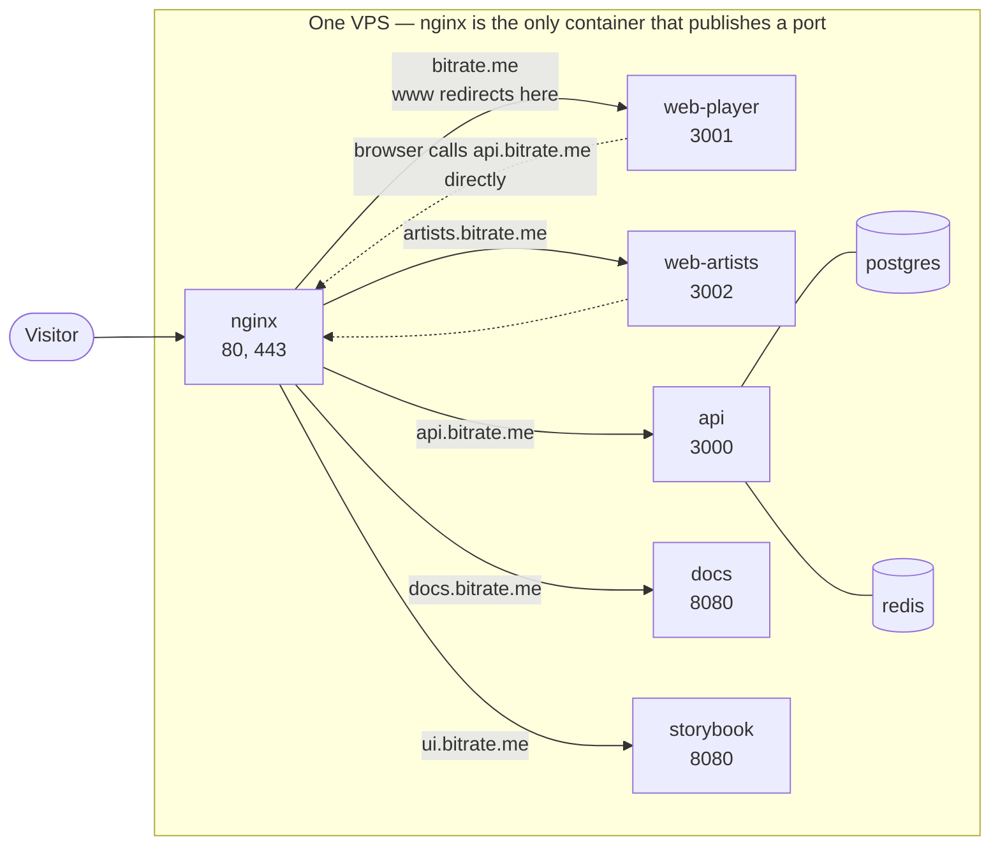
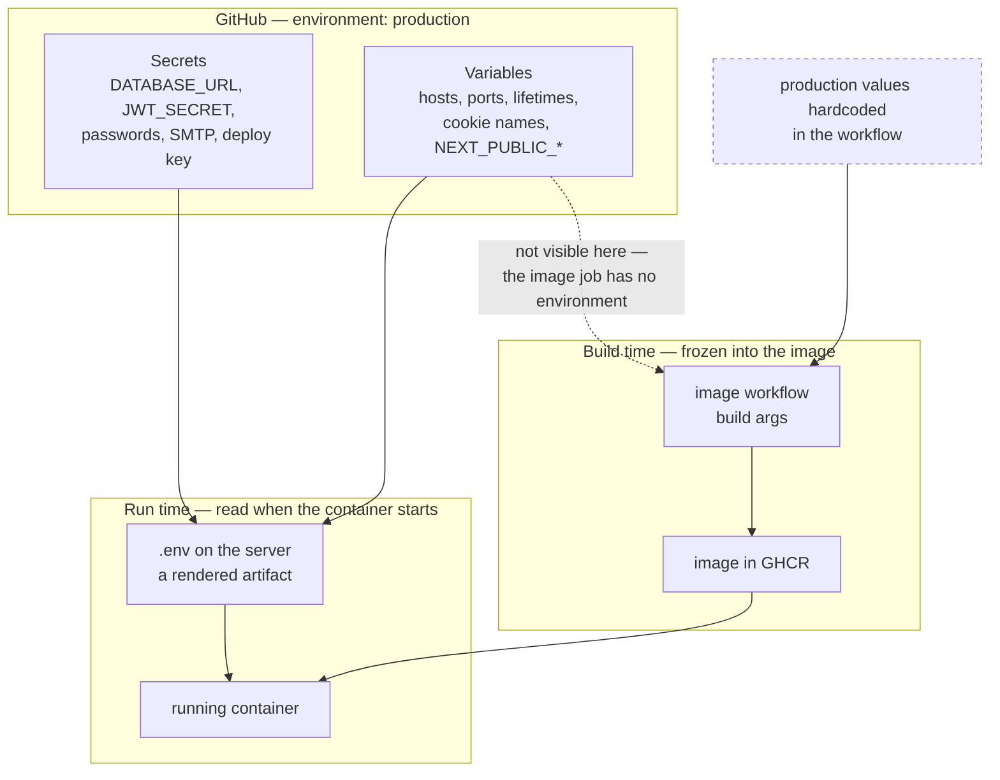
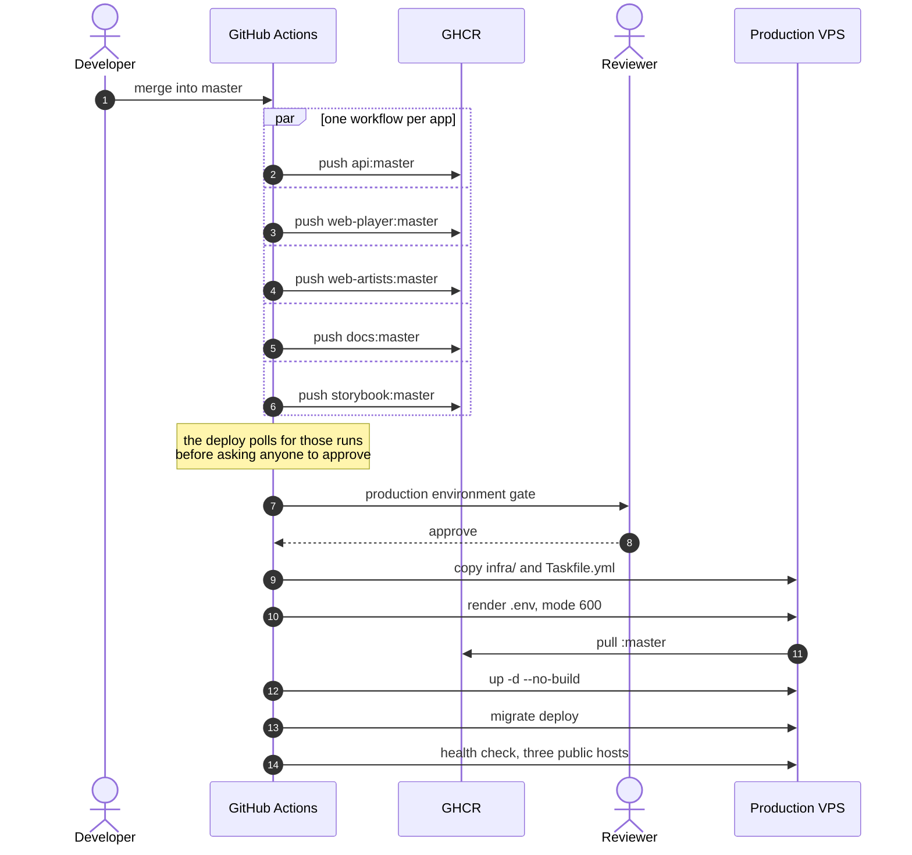

# Deployment

Deploying Bitrate to a single Linux server with Docker Compose.

This is the only deployment path the repository actually supports. Earlier revisions of this
page also described Elastic Beanstalk, Cloud Run, Azure Container Instances, and Kubernetes;
none of them had configuration in the repository, so the instructions could not work. They
were removed rather than left as an untested promise.

## What you are deploying

`infra/docker-compose.prod.yaml` runs eight containers behind one nginx, the only one that
publishes ports:

| Container | Role | Host it serves |
|---|---|---|
| `nginx` | TLS termination and routing | all of them — 80, 443 |
| `web-player` | Next.js, port 3001 | the apex, and `www` by redirect |
| `web-artists` | Next.js, port 3002 | `artists.` |
| `api` | NestJS, port 3000 | `api.` |
| `docs` | Docusaurus build on nginx, port 8080 | `docs.` |
| `storybook` | Storybook build on nginx, port 8080 | `ui.` |
| `postgres` | PostgreSQL 16 | — |
| `redis` | Redis 7 | — |

One host, one application; there are no path routes between them. Both frontends request their
build output from `/_next/`, so serving them under paths on a single host made the portal's assets
resolve against the player.



The dotted edges are the part that catches people out: a page served from the apex does not reach
the API through its own origin. The browser calls `api.bitrate.me`, which is why that origin is
compiled into the frontend bundles and why CORS has to allow it.

Only nginx publishes ports. Postgres and Redis are reachable only inside the Docker network —
do not add a `ports:` mapping to them.

## Sizing

`api`, `web-player` and `web-artists` are capped at 512 MB each, `docs` and `storybook` at 128 MB, so the stack idles at roughly 3 GB
including Postgres, Redis, nginx, and the OS. **8 GB is the practical floor**, because the
production compose builds images on the server and two parallel Next.js builds can ask for more
than the idle stack leaves free.

Audio transcoding (ffmpeg, via the BullMQ consumer in `apps/api`) is the only CPU-heavy work.
Four cores is comfortable for a small deployment.

## Prerequisites

- Docker Engine with the Compose plugin
- [`task`](https://taskfile.dev/installation/) — the only supported interface to the Docker and
  database workflows in this repository
- A domain pointing at the server's IP

Node and pnpm are **not** needed on the host; everything is built inside containers.

## 1. Harden the server

Before anything else:

```bash
# key-only SSH
sudo sed -i 's/^#\?PasswordAuthentication.*/PasswordAuthentication no/' /etc/ssh/sshd_config
sudo systemctl reload ssh

# only SSH and the web ports
sudo ufw allow OpenSSH && sudo ufw allow 80,443/tcp && sudo ufw enable

sudo apt install -y fail2ban unattended-upgrades
```

Run the stack as a non-root user in the `docker` group, not as root.

### Swap

Images are built in CI, not here — swap matters for the running stack, not for a build. On
an 8 GB machine that can exhaust memory mid-build:

```bash
sudo fallocate -l 4G /swapfile && sudo chmod 600 /swapfile
sudo mkswap /swapfile && sudo swapon /swapfile
echo '/swapfile none swap sw 0 0' | sudo tee -a /etc/fstab
```

## 2. Clone and configure

```bash
git clone https://github.com/Lordpluha/bitrate.git
cd bitrate
cp .env.example .env
```

Edit the **root** `.env` — not `apps/api/.env`. The compose stacks read only the repository
root, and `.dockerignore` keeps per-app env files out of the image entirely, so a value placed
in one is silently ignored. See [Environment variables](../guides/environment.md) for which file
is read when.

Use `task` rather than calling `docker compose` by hand. Compose looks for `.env` beside the
compose file, so a bare `docker compose -f infra/docker-compose.prod.yaml` reads `infra/.env`,
finds nothing, and resolves every variable to an empty string without saying so. The `task`
targets pass `--env-file .env` explicitly.

### Where production configuration actually lives

The server's `.env` is a rendered artifact, not the source. The deploy workflow writes it from
GitHub, so editing it by hand on the server works only until the next deploy overwrites it.

| Kind | Stored as | Holds |
|---|---|---|
| Secret | **environment** secret | `POSTGRES_PASSWORD`, `REDIS_PASSWORD`, `JWT_SECRET`, `DATABASE_URL`, `SMTP_USER`, `SMTP_PASS`, both OAuth client secrets, `METRICS_TOKEN`, `SENTRY_DSN`, `DEPLOY_SSH_KEY` |
| Configuration | **environment** variable | hosts, ports, token lifetimes, cookie names, `STORAGE_DRIVER`, both OAuth client ids, `DEPLOY_HOST`, `DEPLOY_USER` |

`NEXT_PUBLIC_*` belong in the variable column on purpose: they are compiled into a client bundle
that any visitor can read, so storing them as secrets protects nothing and only makes them harder
to change.

Both live on the **`production` environment**, not at repository scope, because the same names hold
different values per deployment target. Adding `staging` is then a second environment plus a caller
that passes its name — the reusable workflow itself does not change.

A leftover repository-scoped copy is not an error, which is precisely what makes it dangerous: an
environment-bound job reads repository scope too, and environment only wins on a name collision. The
stale copy would quietly apply to every environment that has not defined its own value. Delete it
rather than leaving it.

The caller passes `secrets: inherit` rather than mapping each secret. It has no choice: GitHub does
not allow `environment:` on a job that calls a reusable workflow, so an explicit
`${{ secrets.X }}` mapping there would be evaluated outside the environment and pass empty strings —
a deploy that succeeds while starting the API with a blank signing key. The cost of `inherit` is
real: every repository secret becomes visible to the called workflow.

One seam to know about. `NEXT_PUBLIC_API_URL`, `NEXT_PUBLIC_SITE_URL` and `API_URL` are also read by
the image-build workflows, which have no environment and therefore fall back to the production
values hardcoded in them. Production is unaffected — the fallbacks match — but the image side is a
separate axis from the server's `.env`, and changing the environment variable will not change a
published bundle.



Read the dotted edge as the rule it is: **changing a variable changes the server's next `.env`, not
any image that has already been built.** A frontend's API origin is decided by the workflow's build
args and frozen when the image is made; no amount of editing configuration afterwards moves it. The
only way to change it is to rebuild.

The same asymmetry explains why editing `.env` on the server looks like it works and then quietly
stops working: the next deploy overwrites the file from GitHub.

`scripts/sync-env-to-github.sh` uploads an existing env file in one pass. It pipes each value into
`gh` on stdin rather than passing it as an argument — arguments are visible to anyone who can run
`ps` — prints names only, and lists any name its classification does not cover, since such a name
would silently vanish from the rendered file.

```bash
./scripts/sync-env-to-github.sh                      # dry run against production
./scripts/sync-env-to-github.sh --apply
./scripts/sync-env-to-github.sh --env staging --apply
```

The environment must exist first, and its required reviewer has to be added by hand — `gh` can
create neither. After writing, the script re-reads the environment and names anything that did not
land: a missing required value aborts the next deploy loudly, but a missing optional one just
reverts to a schema default without saying so.

A compose `--env-file` is not a shell file: compose interpolates `${...}` inside it and treats
` #` as the start of a comment, so a password containing `$` or ` #` is corrupted rather than
rejected. The deploy's preflight fails by name on those characters — regenerate the credential
without them rather than trying to escape it.

The API validates its environment at startup with Zod (`apps/api/env.schema.ts`) and refuses to
boot with a message naming what is missing — so start the stack and read the error rather than
guessing.

Four values need attention:

```bash
# Generate, do not invent
JWT_SECRET=$(openssl rand -base64 48)

# The API sits behind exactly one proxy hop (nginx). Leaving this at 0 makes rate limiting
# and audit logs see nginx's address for every request, which disables brute-force protection.
TRUST_PROXY_HOPS=1

# Must match the certificate issued below, or nginx will not start
DOMAIN=example.com

# Validated as URLs
WEB_HOST=https://example.com
USER_WEB_HOST=https://example.com
ARTIST_WEB_HOST=https://example.com/artists
API_BASE_URL=https://example.com/api
```

`OAUTH_*`, `SMTP_*`, `SENTRY_DSN`, and `METRICS_TOKEN` are optional — the API starts without
them. `EMAIL_FROM` becomes required as soon as `SMTP_HOST` is set.

## 3. Issue the TLS certificate

nginx serves the ACME challenge from `infra/nginx/certbot-webroot`, so the first certificate is
issued before nginx has a certificate to start with. Use standalone mode once, then webroot for
renewals:

```bash
sudo apt install -y certbot
sudo certbot certonly --standalone -d example.com -d www.example.com \
  -d artists.example.com -d api.example.com -d docs.example.com -d ui.example.com \
  --agree-tos -m you@example.com
```

Every name the template declares a server block for. A certificate that omits one means nginx
cannot present a valid certificate for that host.

If the domain sits behind a proxy such as Cloudflare, set these names to DNS-only first. A proxied
name terminates TLS at the edge under the proxy's own certificate, so the origin's never reaches
the visitor and the HTTP-01 challenge is answered by whatever the proxy decides to forward.

The portal needs a separate host rather than a path under the main domain because neither Next.js
app sets `basePath` — both request their build output from `/_next/…`, so under path routing the
portal's assets resolve against the web player, which does not have them.

Certificates land in `/etc/letsencrypt/live/<domain>/`, which the nginx container mounts
read-only. Renewal runs from certbot's own systemd timer; point it at the webroot so it does not
need to stop nginx:

```bash
sudo certbot certonly --webroot -w /path/to/bitrate/infra/nginx/certbot-webroot -d example.com
```

Renewal must use webroot, not standalone: nginx holds port 80, so a standalone renewal cannot
bind it. nginx also caches the certificate at startup and has to be told to re-read it, so the
renewal and the reload belong in one script:

```sh
#!/bin/sh
set -e
docker run --rm \
  -v /etc/letsencrypt:/etc/letsencrypt \
  -v /var/lib/letsencrypt:/var/lib/letsencrypt \
  -v "$HOME/bitrate/infra/nginx/certbot-webroot:/var/www/certbot" \
  certbot/certbot renew --webroot -w /var/www/certbot --quiet
docker exec bitrate-nginx-prod nginx -s reload 2>/dev/null || true
```

Run it weekly from the deploying user's crontab — Docker group membership is enough, no root
required. Verify the whole path with `--dry-run` before trusting it.

## 4. First deploy

```bash
task prod:deploy
```

That pulls the images CI publishes and starts them. Build on the server only when you need
something CI has not published yet:

```bash
task prod:build
```

If the build is killed for memory, build one package at a time:

```bash
COMPOSE_PARALLEL_LIMIT=1 docker compose --env-file .env -f infra/docker-compose.prod.yaml build
```

Compose v2 has no `--parallel` flag — that was v1. And `--env-file` is not optional here for the
reason given two sections above.

Then apply migrations and seed:

```bash
task prod:migrate
```

There is no production seed. The seed script runs through `ts-node` and generates its content
with `@faker-js/faker`, both devDependencies that the production image deliberately omits — and
filling a live catalogue with generated artists is not something to do by accident. A production
database starts empty.

Not `task db:migrate` — that targets the preprod stack and runs `prisma migrate dev`, which
generates migrations, wants a shadow database, and can reset the data it is pointed at.
`prod:migrate` runs `migrate deploy` against the production stack.

## 5. Verify

```bash
task prod:logs                     # all services
curl -f https://example.com/health # nginx
curl -f https://api.example.com/api/v1/health/ready
```

If nginx exits immediately, the usual causes are a `DOMAIN` that does not match the issued
certificate, or a missing certificate at `/etc/letsencrypt/live/<DOMAIN>/`.

## 6. Backups

```bash
task db:backup                     # dump to backups/
task db:restore FILE=backups/2026-09-02_120000.sql
```

`db:restore` is destructive and asks for confirmation. Copy dumps off the machine — a snapshot
of a volume with a running Postgres is not a consistent backup, so volume snapshots are a second
line of defence, not a substitute.

## 7. Updating

A push to `master` deploys on its own. The `[deploy] Production` workflow waits for that commit's
image builds, then stops at the `production` environment for a human to approve; only after the
approval does it touch the server. It renders `~/bitrate/.env` from the repository's secrets and
variables, copies `infra/` and `Taskfile.yml` from the runner, pulls the images, migrates, and
checks all three public hosts.



The wait comes before the gate on purpose: by the time a human is asked, the images either exist or
the run has already failed by name, so nobody approves a release that cannot land.

The environment gate is not automatic. `environment: production` in a workflow blocks nothing by
itself — someone has to create that environment under **Settings → Environments** and add a
**required reviewer**. Until then the deploy runs unattended.

To deploy by hand instead — or when the workflow is unavailable:

```bash
git pull
task prod:deploy
```

`prod:deploy` pulls, migrates, then restarts — in that order and deliberately. Running migrations
after the restart meant the new code answered requests against the old schema for as long as the
migration took, which is the worst of the two windows: new code is precisely what needs the new
columns. Old code meeting an already-migrated schema is the safe direction, and it stays safe as
long as migrations are additive — expand first, contract in a later release, never both at once.

The migration runs in a throwaway container from the image just pulled, so it needs nothing running
but the database.

Production tracks `master`, not `develop`. CI builds every app image on a push to either branch and
pushes it to GHCR; the compose file names the `:master` tag, so a deploy is a pull and a restart
rather than a twenty-minute build on the production box. `git pull` is still required for a manual
deploy, and from `master`: the nginx templates, the compose file, and the Taskfile are read from the
checkout rather than from any image, so a checkout on the wrong branch deploys images built from one
commit with configuration from another. The workflow avoids that trap by copying those files from
the runner rather than asking the server to fetch — the server's unauthenticated `git` access to
GitHub is throttled intermittently, and a fetch that fails silently leaves exactly that mismatch.

`prod:deploy` passes `--no-build` deliberately. Without it, compose quietly builds any service
whose image it cannot pull, and a deploy meant to take two minutes silently becomes the slow path.

The images are `ghcr.io/lordpluha/bitrate/<service>:master` for `api`, `web-player`,
`web-artists`, `docs`, and `storybook`. `NEXT_PUBLIC_*` values are baked in at build time, so an
image built against the wrong API origin cannot be corrected by editing `.env` — the workflow's
build args are the place to look.

## 8. Rolling back

Every master build publishes two tags for each service: the moving `:master`, and the immutable
commit SHA. A rollback is therefore a redeploy of an older SHA, not a rebuild — the artefact that
worked is still in the registry.

```bash
# On the server. Find the commit you want back:
git -C ~/bitrate log --oneline master | head

# Redeploy every service from that commit's images:
IMAGE_TAG=<the commit sha> task prod:deploy
```

The tag is a variable in the compose file, so this needs no editing and nothing to undo afterwards:
the next ordinary deploy renders a fresh `.env` without `IMAGE_TAG`, the default takes over, and
production is back on `:master`.

Re-tagging the images locally instead does **not** work, however intuitive it looks. `prod:deploy`
runs `pull` before `up`, and the pull re-points a locally re-tagged name back at the registry's
version — quietly undoing the rollback and restarting the release you were trying to escape.

Two things a rollback does not undo:

- **Migrations.** `migrate deploy` only moves forward. An older image against a newer schema works
  only if the migration was additive. Before rolling back across one, check what it did — a dropped
  column is not recoverable by redeploying the previous image.
- **The checkout.** `infra/`, the nginx templates and the Taskfile come from the working tree, not
  from an image. If the bad release changed any of them, `git -C ~/bitrate checkout <sha> -- infra
  Taskfile.yml` as well, or the old containers run behind new routing.

The durable fix is the next deploy, not the rollback: push the revert to `master` and let the normal
path run, so the registry and the checkout agree again.

## Outbound SMTP is blocked on standard ports

Most hosting providers block outbound 25, 465, and 587 to limit spam, and they do it silently —
the connection times out rather than being refused, so a mail failure looks like a hang. Verified
on netcup: 25, 465, and 587 all time out while **2465 and 2587 are open**, which is why
transactional providers publish those alternatives.

Check before assuming the credentials are wrong:

```bash
docker exec <api-container> node -e '
  const net = require("net")
  const s = net.connect(2587, "smtp.resend.com", () => { console.log("open"); s.destroy() })
  s.setTimeout(6000, () => { console.log("timed out"); process.exit(0) })
  s.on("error", e => console.log("refused:", e.code))'
```

Use 2587 (STARTTLS) or 2465 (implicit TLS). `SMTP_PORT` drives which one the API negotiates.

## Monitoring

The API exposes Prometheus metrics at `/metrics` under the names `bitrate_api_http_requests_total`
and `bitrate_api_http_request_duration_ms_sum`. Set `METRICS_TOKEN` (32 characters or more) to
require a bearer token; without it the endpoint is unauthenticated.

Container logs are capped at 10 MB × 3 files per service in the production compose. Without that
cap Docker's json-file driver grows until the disk is full.

## Security checklist

- [ ] Key-only SSH, firewall limited to 22/80/443, `fail2ban` running
- [ ] `TRUST_PROXY_HOPS=1` — otherwise rate limiting sees only nginx
- [ ] **Rotate the credentials the removed admin panel published.** Its Kottster secret key,
      API token, JWT salt, and root password were literals in a public repository until
      [ADR-0025](../architecture/0025-remove-admin-panel.md) deleted the app. Deleting the
      code does not un-publish them: revoke the Kottster API token in its dashboard.
- [ ] `JWT_SECRET` generated, not invented
- [ ] Postgres and Redis have no published ports
- [ ] Backups running and restored at least once as a test
- [ ] **GHCR package visibility reviewed.** The published images and their build caches are
      readable without authentication by default. The application images are meant to be pullable
      by the server, but `cache/*` serves no one outside CI and exports intermediate build stages,
      so anything that reaches a build context reaches it too.
- [ ] **Committed env files audited.** `apps/api/.env.development`, `apps/api/.env.test` and
      `apps/web-player/.env.development` are tracked in a public repository — Jest and the E2E
      suite read the first one, so they cannot simply be deleted. Confirm they hold only local
      placeholders; anything real in them is already published.
- [ ] `DEPLOY_SSH_HOST_KEY` pinned. Until it is set the deploy trusts the host key it sees on
      first connection, which is weaker than verification — read the fingerprint from the deploy
      log, check it against the server, then set the variable.

## Related

- [Docker setup](./docker.md) — the compose stacks and local development
- [Environment variables](../guides/environment.md)
- [ADR-0024](../architecture/0024-rebrand-to-bitrate.md) — infrastructure identifiers
